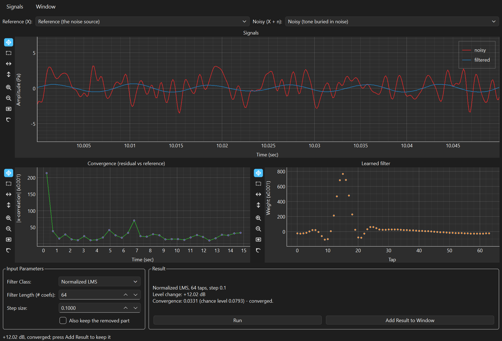

# Adaptive Filtering (LMS)

Every other window in SPWB measures what is there. This one removes
something — a hum, a fan, a machine in the next bay, a heartbeat — from a
recording where it is mixed with what you actually wanted.

It can do that without you describing the interference at all, provided you
can give it **a second signal that is related to the noise and unrelated to
the thing you are trying to hear**. From those two it learns the path
between them, sample by sample, and subtracts its estimate. What is left is
your signal.

Everything in this manual is worked on the demonstration file in `.data/`,
whose expected values are checked by `tools/verify_demo_data.py`. Every
number quoted below was produced by the application itself, not derived on
paper — so if a number here disagrees with your screen, that is a bug worth
reporting.

> **▶ Prefer to run it?** Every example here is also a section of the
> companion notebook,
> [**Adaptive Filtering — worked examples**](notebooks/adaptive-filtering.ipynb),
> which GitHub renders with all its output and graphs. It computes the same
> numbers in a few lines of `spwb.processing` — no GUI, no Qt — and asserts
> each one. Its source is
> [`examples/manuals/adaptive_filtering.py`](../../examples/manuals/adaptive_filtering.py).

**Contents**

* [Where this comes from](#where-this-comes-from)
* [What you need before you start](#what-you-need-before-you-start)
* [Opening the window](#opening-the-window)
* [A tour of the controls](#a-tour-of-the-controls)
* [Worked example 1 — rescuing a buried tone](#worked-example-1--rescuing-a-buried-tone)
* [Worked example 2 — filter length, the control that decides everything](#worked-example-2--filter-length-the-control-that-decides-everything)
* [Worked example 3 — step size, and what convergence does not tell you](#worked-example-3--step-size-and-what-convergence-does-not-tell-you)
* [Getting the result out](#getting-the-result-out)
* [The maths, and how it is pinned to LabVIEW](#the-maths-and-how-it-is-pinned-to-labview)
* [Tips and traps](#tips-and-traps)
* [The same analysis in a notebook](#the-same-analysis-in-a-notebook)
* [Reference tables](#reference-tables)

---

## Where this comes from

**The algorithm is from 1960, and it was not invented for this.** Bernard
Widrow and his student Ted Hoff were building ADALINE at Stanford — an
adaptive linear neuron, one of the first learning machines — and needed a
rule for nudging its weights towards a better answer after each example.
What they published in "Adaptive switching circuits" is now called the
least-mean-squares algorithm, or the Widrow-Hoff delta rule, and it is
about as simple as a learning rule can be: look at the error you just made,
and adjust each weight in proportion to it and to the input that caused it.

Two things came out of that room. One is this window. The other is modern
machine learning — the delta rule is gradient descent, and backpropagation
is what you get when you apply it through layers. (Ted Hoff went to Intel a
decade later and helped architect the 4004, the first microprocessor, which
makes his 1960s afternoon unusually productive by any standard.)

**Then in 1975 Widrow's group showed what it was *for*.** "Adaptive noise
cancelling: principles and applications" is one of those papers whose
examples are more famous than its equations. The one everybody remembers:
recording a fetal heartbeat from electrodes on the mother's abdomen, where
the mother's own heartbeat is far louder than the baby's. Put a second
electrode on her chest — which picks up her heartbeat and essentially none
of the baby's — feed that in as the reference, and the filter learns how
the maternal signal reaches the abdominal electrode and subtracts it. The
baby's heartbeat is left standing.

**That example contains the whole method, and its one condition.** The
chest electrode works as a reference because it is correlated with the
interference and *uncorrelated with the signal of interest*. Give the
filter a reference that also contains what you want, and it will
enthusiastically cancel the thing you were trying to keep. Everything in
[Tips and traps](#tips-and-traps) descends from that sentence.

**The applications went everywhere.** Echo cancellation on long-distance
and satellite telephone circuits, which is why LMS runs in essentially every
phone call. Active noise control, whose idea is older than the algorithm —
Paul Lueg patented cancelling sound with anti-sound in the 1930s, and Harry
Olson built an "electronic sound absorber" in the 1950s — but which only
became practical once a filter could adapt to a changing environment in real
time. Amar Bose is said to have started sketching the headphone version on a
flight in 1978, irritated by the engine noise defeating the airline's
headset.

**One later refinement matters to this window.** Plain LMS has an awkward
property: its stable step size depends on how loud the reference happens to
be, so a setting that works on one recording diverges on the next. The
normalised variant, published independently by Nagumo and Noda and by Albert
and Gardner in 1967, divides the update by the reference's own power, which
makes the step size a dimensionless number with a fixed stable range of
0 to 2. That is why **Normalized LMS is this window's default**, and
[example 3](#worked-example-3--step-size-and-what-convergence-does-not-tell-you)
shows what happens when you use plain LMS with a normalised step.

<details>
<summary>Sources, if you want to check any of this</summary>

* B. Widrow and M. E. Hoff, "Adaptive switching circuits", *IRE WESCON
  Convention Record*, 1960.
* B. Widrow et al., "Adaptive noise cancelling: principles and
  applications", *Proc. IEEE* 63(12), 1975 — the fetal ECG example.
* J. Nagumo and A. Noda, and separately A. Albert and L. Gardner, on the
  normalised algorithm, 1967.
* P. Lueg, US patent 2,043,416, 1936, on cancelling sound with anti-sound.

</details>

---

## What you need before you start

Two recordings of the same moment:

| Role | What it must be |
|---|---|
| **Noisy (X + n)** | The recording you want cleaned: your signal *plus* the interference. |
| **Reference (X)** | A signal **correlated with the interference** and **not correlated with what you want to keep**. |

The reference is the whole game. In practice it is a second microphone near
the noise source, an accelerometer on the offending machine, a tacho pulse
from a shaft, or — as in the 1975 paper — an electrode somewhere the
interference dominates.

**What it must not be** is a recording that also contains your signal. If
it does, the filter will cancel your signal along with the noise, and it
will do so efficiently.

The demonstration file is `14_LMS_Noise_cancellation.h5`. Create it with
**File > Create Demo Data ...**, `from spwb.demo import write_demo_data`, or
`python tools/make_demo_data.py`.

---

## Opening the window

Load the file into a **Time Processing** window, tick the signals, then
**Analysis > Adaptive Filtering (LMS) ...** (`Ctrl+L`).

Then set the two roles at the top, **Reference (X)** and **Noisy (X + n)**,
and press **Run**. Nothing is computed until you do — unlike the FFT and
Transfer Function windows, this one does not recompute as you type, because
a long adaptive run is not something to trigger on every keystroke.

---

## A tour of the controls

`14_LMS_Noise_cancellation.h5` after a successful run, zoomed to 50 ms so
the recovered tone is visible:



### The three plots

**Signals** overlays the noisy input (red) with the filtered result (blue).
In the shot, the red trace is chaos and the blue one is a clean 120 Hz sine
— that is the entire point of the window in one picture.

**Convergence (residual vs reference)** is the cross-correlation between
what is left and the reference, one point per block, over time. It should
fall and stay down. The dotted line is the **chance level** — the
correlation two unrelated signals of that block length would score anyway.

**Learned filter** plots the coefficients the filter arrived at. On a
successful run this is a picture of the actual physical path between the
reference and the interference.

### Input Parameters

| Control | Default | What it does |
|---|---|---|
| **Filter Class** | Normalized LMS | LMS, Normalized LMS, or the two Noise Cancelling presets. |
| **Filter Length (# coefs)** | 64 | Number of taps. **It must span the delay and reverberation between reference and interference** — see [example 2](#worked-example-2--filter-length-the-control-that-decides-everything). |
| **Step size** | 0.1 | How fast it adapts. 0 to 2 for the normalised algorithms. Plain LMS needs a far smaller value. |
| **Also keep the removed part** | off | Adds what the filter took out as a second signal, so you can check it. |

### Result

The summary reports the class, taps and step; the **level change in dB**;
and the convergence value against the chance level, with a verdict:

```
Normalized LMS, 64 taps, step 0.1
Level change: +12.02 dB
Convergence: 0.0331 (chance level 0.0793) - converged.
```

**Add Result to Window** keeps the cleaned signal, so you can send it to an
FFT window or save it. Until you press it, the run is only on screen.

---

## Worked example 1 — rescuing a buried tone

**File:** `14_LMS_Noise_cancellation.h5` — a 120 Hz tone at 0.5 Pa peak,
buried under noise that reached the microphone through a 31-tap filter, at
15 s and 8192 Hz. The reference is the noise *before* that path. The clean
tone is included as ground truth, so you can check the answer.

The starting position:

| Signal | RMS | 120 Hz peak |
|---|---|---|
| Noisy (tone buried in noise) | 1.474 Pa | 0.552 |
| Reference (the noise source) | 1.001 Pa | — |
| **Wanted signal (ground truth)** | **0.354 Pa** | **0.500** |

The noisy recording is **4.17 times** the level of the tone hidden inside
it. Set the roles, leave everything at its defaults, and press **Run**:

| Result | |
|---|---|
| Level change | **+12.02 dB** |
| Convergence | 0.0331, against a chance level of 0.0793 — **converged** |
| RMS after filtering | **0.370 Pa** (ground truth: 0.354) |
| 120 Hz peak after filtering | **0.506** (ground truth: 0.500) |

The tone comes back at 0.506 against a true 0.500 — about 1 % high — and the
residual error against the ground truth is 0.079 Pa RMS over the second half
of the record, once the filter has settled. The first half includes the
adaptation, where it was still learning.

**Look at the Learned filter plot.** The demo's noise path is a 31-tap FIR
scaled by 3, whose largest coefficient is **0.752 at tap 15**. The filter
learned a peak of **0.767 at tap 15**. It did not just cancel the noise; it
reconstructed the physical path, to within 2 %.

**Then check it in the FFT window.** Press **Add Result to Window**, send
the cleaned signal to an FFT window with `Ctrl+F`, and the 120 Hz peak that
was invisible in the time domain is unmistakable.

---

## Worked example 2 — filter length, the control that decides everything

The interference in this file arrives through a 31-tap filter. A filter
with fewer taps than that **cannot represent the path**, no matter how long
it adapts or how carefully you tune the step size. Run the same data at
each length:

| Taps | Level change | Converged? | Residual vs truth |
|---|---|---|---|
| 2 | **−2.24 dB** | "yes" | 1.979 |
| 4 | −0.43 dB | "yes" | 1.501 |
| 8 | −0.29 dB | "yes" | 1.475 |
| 16 | +3.77 dB | no | 0.884 |
| **32** | **+12.07 dB** | yes | **0.082** |
| 64 (default) | +12.02 dB | yes | 0.079 |
| 128 | +11.92 dB | yes | 0.076 |
| 256 | +11.76 dB | yes | 0.073 |

There is a **cliff between 16 and 32 taps**, exactly where the filter
becomes long enough to hold a 31-tap impulse response. Below it the result
is worthless; above it, more taps buy almost nothing — 256 taps is four
times the work of 64 for a 4 % better residual, and each extra tap adds a
little more adaptation noise.

**Set the filter length from the physics, not by trial.** How long is the
path between your reference and the interference — in samples? A metre of
air at 8 kHz is about 24 samples. A reverberant room is hundreds. If you do
not know, start long: an over-long filter costs a little accuracy, an
over-short one costs everything.

---

## Worked example 3 — step size, and what convergence does not tell you

Step size sets how far each sample nudges the coefficients. It trades speed
against precision:

| Step | Level change | Residual vs truth | Blocks to converge |
|---|---|---|---|
| 0.01 | +10.82 dB | **0.020** | 5 |
| 0.05 | +11.96 dB | 0.054 | 1 |
| **0.1** (default) | **+12.02 dB** | 0.079 | 1 |
| 0.5 | +11.08 dB | 0.205 | immediate |
| 1.0 | +9.24 dB | 0.357 | immediate |
| 1.5 | +6.13 dB | 0.627 | immediate |
| 1.9 | −0.88 dB | 1.578 | immediate |

Read the two middle columns against each other, because they disagree and
both are right. **The dB figure is best at 0.1**, but **the actual accuracy
is four times better at 0.01** — where the residual is 0.020 against 0.079.
A small step converges slowly, so more of the record is spent adapting and
the total level drop is smaller; but once settled it tracks far more
precisely. A large step settles instantly and then jitters around the
answer forever, and by 1.9 the jitter is worse than the noise it removed.

**If the signal is stationary and you have plenty of record, use a small
step.** If the interference is changing and the filter has to chase it, use
a larger one. The default 0.1 is a reasonable middle.

### What "converged" does not mean

Look again at the 2-tap row in
[example 2](#worked-example-2--filter-length-the-control-that-decides-everything):
convergence 0.047, verdict **converged**, level change **−2.24 dB**. The
filter made the recording *worse* and reported success.

That is not a bug, and it is worth understanding. The convergence trace
answers one narrow question: *does what is left still correlate with the
reference?* With two taps the filter quickly extracts everything two taps
can explain, and then stops improving — so the correlation settles and the
metric is satisfied. It has converged. It has converged to a bad answer.

**Convergence tells you the filter has stopped learning. The dB figure
tells you whether it did any good.** Read both, and treat a negative dB as
what it is: the reference did not carry the interference, so the filter
contributed nothing but its own misadjustment noise.

The clearest way to produce that: swap the two roles. Feeding the noisy
signal in as the reference gives **−2.86 dB**, and the window says so
directly in the Result box.

### Plain LMS and the step size that is not the same number

The three normalised classes are the same algorithm — the Noise Cancelling
entries are presets named for which signal is wired where — and give
identical results: +12.02 dB, convergence 0.0331.

Plain **LMS** is different, and its step size means something else
entirely. Ask for the normalised default of 0.1 — or anything near it — and
it diverges. SPWB catches that and tells you the actual limit for *your*
data rather than failing with infinities:

```
the filter diverged with 'LMS' at step size 1. Plain LMS is stable only
for a step below about 0.0312 with this reference (64 taps, mean square
1.003). Reduce the step size, or use 'Normalized LMS', which rescales by
the reference power and takes the documented 0 to 2 range.
```

At a sensible 0.01, plain LMS reaches +10.62 dB with a residual of 0.242 —
worse than the normalised algorithm at any of its settings here. Unless you
are matching a legacy result, use Normalized LMS.

---

## Getting the result out

**Add Result to Window** puts the cleaned signal into this window's own
list, named `... (LMS)`. With **Also keep the removed part** ticked you also
get `... (removed)` — the interference the filter identified, which is worth
looking at: if it contains any of your signal, your reference is
contaminated.

From there it is an ordinary signal. Send it to an FFT window (`Ctrl+F`) to
confirm the tone, back to a Time Processing window to save it, or to the
Time-Frequency window to see when the cancellation settled.

---

## The maths, and how it is pinned to LabVIEW

From `Initialize LMS Filter.vi`, `Apply LMS Filter.vi` and
`Iteration Metric - X Correlation.vi`:

For each sample, with reference history **x** and coefficients **w**:

1. **Predict** the interference: `y = wᵀx`
2. **Error**, which is the output you want: `e = d − y`
3. **Update**: `w ← w + μ·e·x` for LMS, or
   `w ← w + μ·e·x / (‖x‖² + ε)` for the normalised variants.

The division in step 3 is the entire difference between the two classes,
and the reason the normalised step size is dimensionless with a fixed 0-to-2
stable range while the plain one scales with the reference power.

**The output is the error signal, not the filter output.** That trips
people up: `e` is the cleaned signal and `y` is what was removed. The window
plots `e` as *filtered* and offers `y` under "Also keep the removed part".

**Convergence is judged by cross-correlation**, as the original does. The
LabVIEW block diagram carries the author's comment — *"The X-Correlation
between the LMS Filtered speech and LMS Filtered BGN should be 0 !!"* — with
an accept band of 0 to 0.01. The port keeps that band but compares against
**the larger of it and the chance level** for the block length, because two
unrelated blocks of a few hundred samples already correlate at around 0.1,
and judging against 0.01 alone would report "not converged" for a filter
that has done everything possible.

**None of these numbers were re-derived.** The test suite compares them
against reference data generated by driving LabVIEW 2022 itself over COM,
committed in `tests/fixtures/`.

---

## Tips and traps

**The reference must not contain your signal.** This is the one rule. If it
does, the filter cancels what you wanted to keep, efficiently and without
complaint.

**A negative dB means the reference is wrong, not that the step size needs
tuning.** Check which signal is in which selector first.

**"Converged" is not "worked".** It means the filter stopped learning. A
2-tap filter converges to a useless answer in a fraction of a second.

**Set the filter length from the physics.** It must span the delay and
reverberation between reference and interference. Too short fails
completely; too long is only mildly wasteful.

**Total reduction is bounded by how much of the input was noise.** Cancel
the noise perfectly out of a signal that is half noise and you get about
3 dB, not infinity. The +12 dB here is possible because the recording is
mostly noise.

**Plain LMS does not take the normalised step size.** Its stable limit
depends on your reference's power — for this file, 0.0312.

**The run is not saved until you press Add Result to Window.** Changing any
parameter discards it.

**Check the removed part when you are unsure.** If the interference the
filter pulled out contains a recognisable piece of your signal, the
reference is contaminated.

---

## The same analysis in a notebook

Everything above is the GUI driving a library that has no idea Qt exists.
All three examples are worked in code in the companion notebook —
[**Adaptive Filtering — worked examples**](notebooks/adaptive-filtering.ipynb),
source at
[`examples/manuals/adaptive_filtering.py`](../../examples/manuals/adaptive_filtering.py).
Run it with:

```bash
python examples/manuals/adaptive_filtering.py
```

In miniature:

```python
from spwb.processing.dsp.adaptive import lms_filter
from spwb.processing.io import read_hdf5

signals = {s.name: s for s in read_hdf5(
    "demo-data/14_LMS_Noise_cancellation.h5")}

result = lms_filter(signals["Reference (the noise source)"],
                    signals["Noisy (tone buried in noise)"],
                    filter_length=64, step_size=0.1,
                    filter_class="Normalized LMS")

print(f"{result.noise_reduction_db:+.2f} dB")   # +12.02 dB
print(result.converged)                          # True
print(result.filtered.name)   # 'Noisy (tone buried in noise) (LMS)'
print(result.removed.name)    # 'Noisy (tone buried in noise) (removed)'
print(len(result.coefficients))                  # 64
```

`result.filtered` is the cleaned signal and `result.removed` the
interference, both ordinary `Signal` objects. `result.coefficients` is the
learned filter and `result.convergence` the trace, as plain NumPy arrays.

---

## Reference tables

### Filter classes

| Class | Update | Step size range | Use |
|---|---|---|---|
| **LMS** | `w += μ·e·x` | Depends on reference power — for this file, below 0.031 | Matching a legacy result |
| **Normalized LMS** | `w += μ·e·x / ‖x‖²` | 0 to 2 | **The default. Use this** |
| Noise Cancelling (BGN Ref) | as normalised | 0 to 2 | Preset: reference is background noise |
| Noise Cancelling (Speech Ref) | as normalised | 0 to 2 | Preset: reference is the speech |

The two Noise Cancelling entries are the normalised algorithm under
different names — they are labelled for which signal you wire to the
reference, not for different mathematics.

### Reading the result

| Reading | Meaning |
|---|---|
| dB clearly positive, converged | It worked |
| dB positive, not converged | Still adapting — longer record, or a bigger step |
| **dB negative** | **The reference does not carry the interference. Check the roles** |
| Converged but dB near zero | The filter cannot represent the path — more taps |
| Convergence never falls | Reference and interference are unrelated |

### Choosing parameters

| If | Then |
|---|---|
| The path is long or reverberant | More taps |
| The interference is changing | Larger step |
| The signal is stationary and long | Smaller step, for precision |
| Plain LMS diverges | Use Normalized LMS, or read the limit from the message |

### Demo file used in this manual

| File | Shows |
|---|---|
| `14_LMS_Noise_cancellation.h5` | A tone 4× below the noise recovered to within 1 %; the filter-length cliff; the step-size trade; ground truth to check against |

Confirm every value in this manual with `python tools/verify_demo_data.py`.
