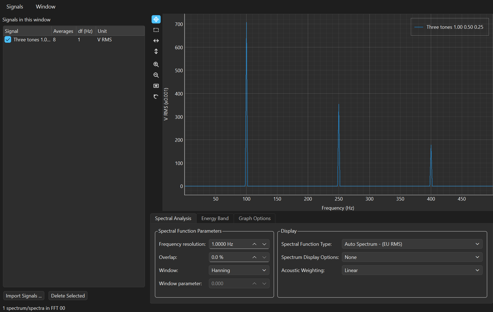
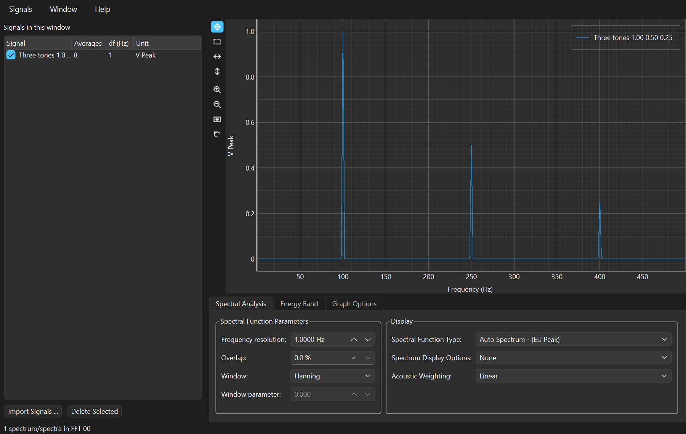
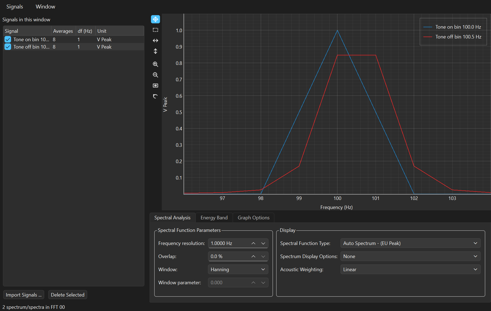
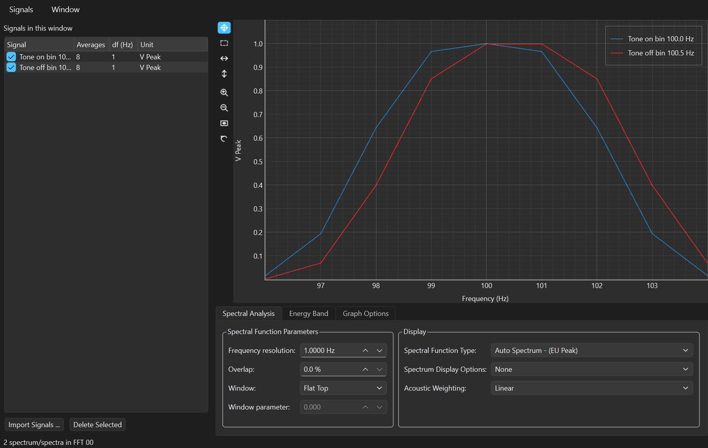
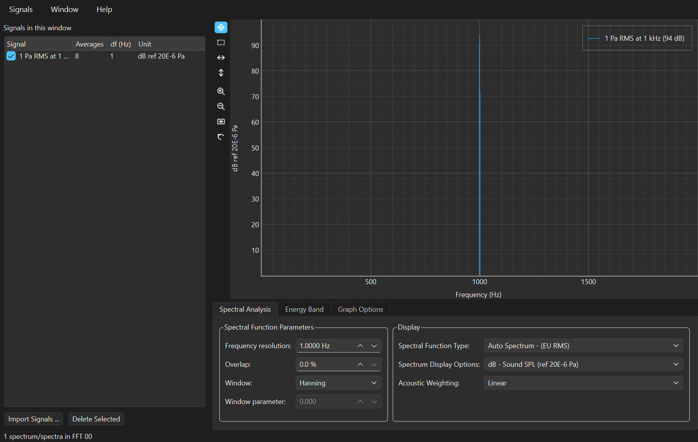
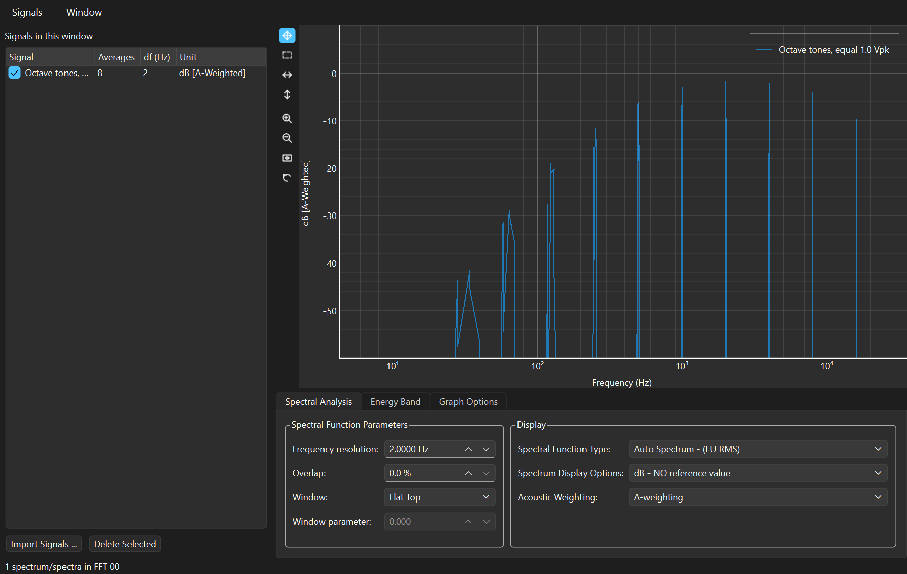
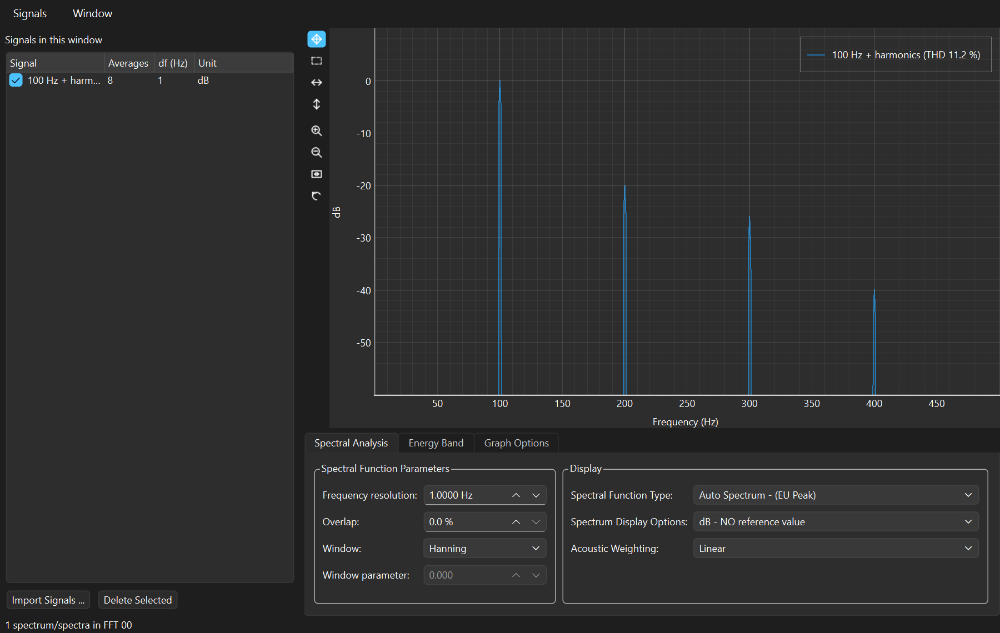
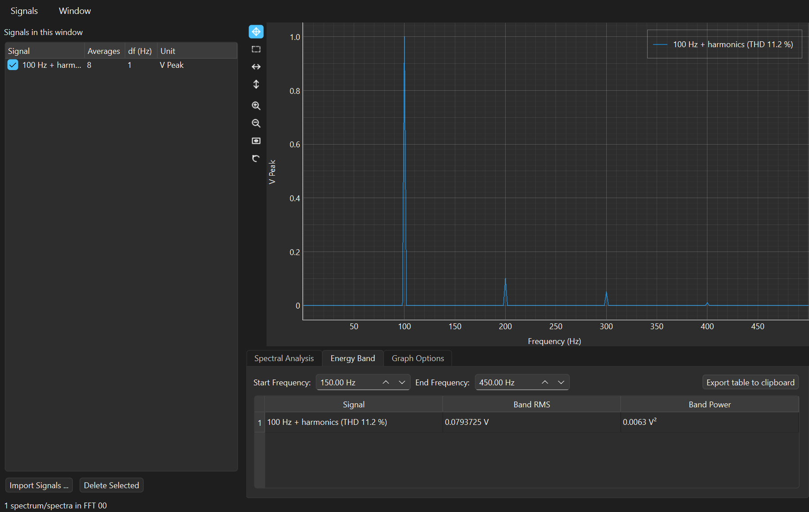

# FFT Analysis

The FFT Analysis window turns time signals into spectra: how much of the
signal sits at each frequency, in the engineering unit you measured in.
It is the window you open to answer "what is that noise at 400 Hz?", "is
my accelerometer reading the level I calibrated it to?" or "how much
distortion does this amplifier add?"

Everything in this manual is worked on the demonstration files in
`.data/`, whose expected values are checked by
`tools/verify_demo_data.py`. Every number quoted below was produced by the
application itself, not derived on paper — so if a number here disagrees
with your screen, that is a bug worth reporting.

> **▶ Prefer to run it?** Every example here is also a section of the
> companion notebook,
> [**FFT Analysis — worked examples**](notebooks/fft-analysis.ipynb), which
> GitHub renders with all its output and graphs. It computes the same
> numbers in a few lines of `spwb.processing` — no GUI, no Qt — and asserts
> each one, so running it top to bottom is itself a check that the port
> still behaves. Its source is
> [`examples/manuals/fft_analysis.py`](../../examples/manuals/fft_analysis.py).

**Contents**

* [Where this comes from](#where-this-comes-from)
* [Opening the window](#opening-the-window)
* [A tour of the controls](#a-tour-of-the-controls)
* [Worked example 1 — amplitudes you can trust](#worked-example-1--amplitudes-you-can-trust)
* [Worked example 2 — leakage, and what the window is for](#worked-example-2--leakage-and-what-the-window-is-for)
* [Worked example 3 — decibels and the 94 dB calibrator](#worked-example-3--decibels-and-the-94-db-calibrator)
* [Worked example 4 — A-weighting](#worked-example-4--a-weighting)
* [Worked example 5 — harmonics, THD and the Energy Band tab](#worked-example-5--harmonics-thd-and-the-energy-band-tab)
* [Getting the numbers out](#getting-the-numbers-out)
* [The maths, and how it is pinned to LabVIEW](#the-maths-and-how-it-is-pinned-to-labview)
* [Tips and traps](#tips-and-traps)
* [The same analysis in a notebook](#the-same-analysis-in-a-notebook)
* [Reference tables](#reference-tables)

---

## Where this comes from

The idea behind this window is two hundred years old, and the reason it
runs in a fraction of a second is sixty.

**Fourier, 1807.** Joseph Fourier, then a prefect under Napoleon, submitted
a memoir to the Paris Institute on the conduction of heat in solids. In it
he claimed that any function could be written as a sum of sines and
cosines. The examining jury included Lagrange, Laplace and Legendre;
Lagrange objected to the generality of the claim and the memoir was not
published. Fourier persisted, and the argument appeared in full in
*Théorie analytique de la chaleur* in 1822. He was right in the ways that
matter to engineering, and the decomposition has carried his name ever
since.

**Doing it was the problem.** For a century, computing a spectrum meant
either grinding through the integrals by hand or building a machine. In
1898 Albert Michelson and Samuel Stratton built a mechanical harmonic
analyser out of eighty springs and levers; it worked, and it produced the
persistent overshoot at discontinuities that J. Willard Gibbs explained the
following year — the ringing now called the Gibbs phenomenon, discovered
because a machine was honest enough to draw it.

**Gauss got there first, and nobody noticed.** In 1805, while interpolating
the orbits of the asteroids Ceres and Pallas, Carl Friedrich Gauss worked
out a method of splitting a Fourier computation into smaller ones — the
algorithm we now call the fast Fourier transform. He never published it. It
appeared in his collected works in 1866, in neo-Latin, and was not
recognised for what it was until Heideman, Johnson and Burrus went looking
in 1984.

**Cooley and Tukey, 1965.** The modern history starts at a meeting of
President Kennedy's Science Advisory Committee, where the problem under
discussion was detecting Soviet nuclear tests from seismometer readings —
which meant computing spectra of long records, then hopelessly expensive.
John Tukey sketched the halving trick on the spot. Richard Garwin saw what
it was worth and pressed James Cooley at IBM to implement it, and the
resulting three-page paper in *Mathematics of Computation* changed
practical signal processing overnight. The cost of a transform fell from
about N² operations to N log N. For the 8192-point blocks used in the
examples below, that is roughly 67 million operations against 106
thousand — a factor of 600. Cooley and Tukey deliberately did not patent
it.

**The corrections came next, and they are what most of this window's
controls do.** A real measurement is a finite slice of an infinite signal,
and chopping it introduces errors of its own. Blackman and Tukey's 1958
monograph on measuring power spectra established the practice of tapering
each slice before transforming it; the taper they popularised was named
"hanning" after the Austrian meteorologist Julius von Hann, alongside
"hamming" after Bell Labs' Richard Hamming — the near-collision of names
has confused students ever since. Maurice Bartlett (1948) and Peter Welch
(1967) showed that averaging many short, overlapping blocks buys a stable
estimate at the price of frequency resolution, which is exactly the trade
the **Frequency resolution** and **Overlap** controls make. Fredric Harris
catalogued the windows systematically in 1978, and Albert Nuttall corrected
and extended him in 1981; between them they defined the figures of merit —
coherent gain, equivalent noise bandwidth, scalloping loss — that the
[reference table](#windows) at the end of this manual lists.

**And the acoustics.** The decibel came out of Bell Telephone Laboratories
in the 1920s, named for Alexander Graham Bell. In 1933 Harvey Fletcher and
Wilden Munson published the equal-loudness contours: the sound pressure a
tone needs at each frequency to be judged as loud as a 1 kHz reference. The
inverse of their 40-phon contour, standardised for American sound level
meters in 1936, is the A-weighting curve still in the **Acoustic
Weighting** menu — an eighty-year-old approximation of one aspect of human
hearing that has outlived every attempt to replace it. Its reference
pressure, 20 µPa, is roughly the quietest 1 kHz tone a good ear can detect;
1 Pa above it is 94 dB, which is why acoustic calibrators produce exactly
that level and why demo file 06 exists.

By around 1970 all of this had been packed into dedicated FFT analysers
sitting on trolleys in test labs, and the front panel of that instrument —
resolution, averaging, window, function type, display units, weighting — is
what you see in the tabs below. SPWB's LabVIEW original reproduced it; this
Python port reproduces SPWB.

<details>
<summary>Sources, if you want to check any of this</summary>

* J. Fourier, *Théorie analytique de la chaleur*, 1822.
* A. A. Michelson and S. W. Stratton, "A new harmonic analyzer",
  *American Journal of Science*, 1898.
* M. T. Heideman, D. H. Johnson and C. S. Burrus, "Gauss and the history
  of the fast Fourier transform", *IEEE ASSP Magazine*, 1984.
* J. W. Cooley and J. W. Tukey, "An algorithm for the machine calculation
  of complex Fourier series", *Mathematics of Computation* 19, 1965.
* R. B. Blackman and J. W. Tukey, *The Measurement of Power Spectra*,
  Dover, 1958.
* P. D. Welch, "The use of fast Fourier transform for the estimation of
  power spectra", *IEEE Trans. Audio and Electroacoustics* AU-15, 1967.
* F. J. Harris, "On the use of windows for harmonic analysis with the
  discrete Fourier transform", *Proc. IEEE* 66(1), 1978; A. H. Nuttall,
  "Some windows with very good sidelobe behavior", *IEEE Trans. ASSP*
  29(1), 1981.
* H. Fletcher and W. A. Munson, "Loudness, its definition, measurement and
  calculation", *J. Acoust. Soc. Am.* 5, 1933. The current weighting
  standard is IEC 61672.

</details>

---

## Opening the window

Signals always start in a **Time Processing** window, which is what opens
when you launch SPWB.

1. **File > Open ... > SPWB / HDF5 (\*.h5, \*.hdf5)** (`Ctrl+O`) and pick a
   file — for this manual, the demo files in `.data/`.
2. **Analysis > Spectrums (FFT) ...** (`Ctrl+F`). The selected signals — or
   all visible ones if you have selected nothing — are handed to a new FFT
   Analysis window.

Once open, the window can also pull signals in for itself with **Signals >
Import Signals ... > Another Window** (`Ctrl+I`), or the **Import
Signals ...** button under the list. Any number of FFT windows can be open
at once (**Window > New FFT Window**, `Ctrl+N`), each with its own
settings — which is how you compare two window functions side by side, as
in [example 2](#worked-example-2--leakage-and-what-the-window-is-for).

> **The spectra are always live.** Nothing here is a snapshot. Change a
> parameter and every spectrum is recomputed from its source time signal
> immediately. There is no "compute" button to forget to press, and no way
> to end up looking at a plot that does not match the settings underneath
> it.

---

## A tour of the controls

This is the window as it opens, with `04_FFT_Tones_known_amplitudes.h5`
loaded and nothing touched yet:



### The signal list

| Column | Meaning |
|---|---|
| **Signal** | Name of the source time signal. The checkbox shows and hides its curve. |
| **Averages** | How many blocks were averaged to make this spectrum. Here, 8. |
| **df (Hz)** | The frequency resolution actually achieved — not always the one you asked for; see [Tips](#tips-and-traps). |
| **Unit** | The unit of the displayed spectrum, which changes with the function type and display option. |

Select rows and press **Delete Selected** to drop signals from this window.
That does not touch the time signal in the window it came from.

### Spectral Analysis tab

**Spectral Function Parameters** — how the transform is computed:

| Control | Default | What it does |
|---|---|---|
| **Frequency resolution** | 1.0000 Hz | Sets the block length: `L = fs / df` samples. Finer resolution means longer blocks, so fewer of them to average. |
| **Overlap** | 0.0 % | How much each block overlaps the previous one, 0–95 %. Overlapping recovers averages lost to a fine resolution. 50 % is the usual choice with Hanning. |
| **Window** | Hanning | The taper applied to each block before transforming. See [example 2](#worked-example-2--leakage-and-what-the-window-is-for). |
| **Window parameter** | *(disabled)* | Enabled only for the three windows that take one: Kaiser (β, default 0), Dolph-Chebyshev (sidelobe ratio in dB, default 60) and Gaussian (standard deviation as a fraction of block length, default 0.2). |

**Display** — how the computed spectrum is presented. None of these change
the computation; they rescale it, so switching between them is instant and
lossless:

| Control | Default | What it does |
|---|---|---|
| **Spectral Function Type** | Auto Spectrum - (EU RMS) | Amplitude or power, RMS or peak, and whether to divide by bandwidth to get a density. Eight combinations, [tabulated below](#spectral-function-types). |
| **Spectrum Display Options** | None | Linear, or decibels against a chosen reference. |
| **Acoustic Weighting** | Linear | Linear (none) or A-weighting. |

### Energy Band tab

Sums the power between a **Start Frequency** and an **End Frequency** and
reports it as **Band RMS** and **Band Power**, per signal. This is how you
get a single number out of a spectrum — the RMS of one machine order, the
level in a third-octave band, the total distortion.
**Export table to clipboard** copies it as tab-separated text, ready to
paste into a spreadsheet.

### Graph Options tab

**Frequency axis** and **Amplitude axis**, each Linear or Logarithmic.
Logarithmic frequency drops the DC bin, as analysers do — log(0 Hz) does
not exist.

### The plot

The toolbar down the left of the plot is the tool palette SPWB's LabVIEW
front panels had. The top four choose what dragging on the graph does —
**Pan**, **Zoom** to a rectangle, **Zoom X** and **Zoom Y** — and only one
is active at a time. The four below are one-shot buttons: zoom in, zoom
out, **fit to all data**, and undo the last zoom. The legend names the
curves, and colours are assigned in list order.

### Status bar

Reports the number of spectra in the window and its name (`FFT 00`). It is
also where two warnings appear: that a requested resolution was not
achievable, and that a signal could not be transformed at all.

---

## Worked example 1 — amplitudes you can trust

**File:** `04_FFT_Tones_known_amplitudes.h5` — three tones at 100, 250 and
400 Hz with amplitudes of exactly 1.00, 0.50 and 0.25 V, sampled at
8192 Hz for 8 s.
▶ *In code: [notebook section 1](notebooks/fft-analysis.ipynb).*

Open it, send it to an FFT window, and leave every setting alone. You get
the screenshot [above](#a-tour-of-the-controls). Note what the window did
without being asked: `df = 1 Hz` at `fs = 8192 Hz` means 8192-sample
blocks, and 8 s of data gives **8 blocks**, so the plot is an average of 8
spectra. The **df (Hz)** column reads exactly `1`, because 8192/1 divides
evenly.

The peaks read 707, 354 and 177 — on an axis labelled `V RMS (×0.001)`, so
0.707, 0.354 and 0.177 V RMS. Correct: a 1 V amplitude sine has an RMS of
1/√2 = 0.7071. But if you want to read tone *amplitudes* straight off the
plot, set **Spectral Function Type** to `Auto Spectrum - (EU Peak)`:



Now the peaks are 1.00, 0.50 and 0.25 exactly — the numbers the file says
they should be. The same three tones in all four common function types:

| Spectral Function Type | 100 Hz | 250 Hz | 400 Hz | Unit |
|---|---|---|---|---|
| Auto Spectrum - (EU Peak) | 1.00000 | 0.50000 | 0.25000 | V Peak |
| Auto Spectrum - (EU RMS) | 0.70711 | 0.35355 | 0.17678 | V RMS |
| Power Spectrum - (EU RMS²) | 0.50000 | 0.12500 | 0.03125 | V² RMS² |
| Power Spectrum - (EU Peak²) | 1.00000 | 0.25000 | 0.06250 | V² Peak² |

**Why it comes out exact.** The tones sit on exact bin centres — 100, 250
and 400 are whole multiples of the 1 Hz resolution — so all of each tone's
energy lands in one bin. That is a property of this contrived file, not of
measurements. Real signals almost never oblige, which is the subject of the
next example.

**Try this:** change the resolution to 0.5 Hz and watch the **Averages**
column drop from 8 to 4 — half as many blocks, twice as long. Then set
**Overlap** to 50 % and it climbs to 7. Overlapping is how you buy
averaging back when you need fine resolution and have a fixed record
length.

---

## Worked example 2 — leakage, and what the window is for

**File:** `05_FFT_Leakage_window_choice.h5` — the same 1 V tone twice: once
at exactly 100.0 Hz, once at 100.5 Hz, half a bin off.
▶ *In code: [notebook section 2](notebooks/fft-analysis.ipynb).*

Load it, set **Spectral Function Type** to `Auto Spectrum - (EU Peak)`,
leave the window on Hanning, and zoom into 96–104 Hz:



The on-bin tone (blue) peaks at 1.000. The off-bin tone (red) peaks at
**0.849** — the same tone, 15 % low. Nothing is wrong with the signal and
nothing is wrong with the software. The tone's energy falls between two
bins and neither one gets all of it. This is *scalloping loss*, and it is
the single most common way a spectrum lies to you about amplitude.

Now change **Window** to `Flat Top`:



The off-bin tone reads **0.99888** — 0.1 % low instead of 15 %. That is
what the flat-top window is for: it is deliberately wide, so that a tone
anywhere between two bins still reads its true amplitude. It was designed
for exactly this job, calibration, and it pays for the accuracy with
resolution — a flat-top peak is nearly four bins wide, so two tones close
together merge into one.

The same measurement across the window menu, on this file:

| Window | On-bin 100.0 Hz | Off-bin 100.5 Hz | Error | ENBW (bins) |
|---|---|---|---|---|
| Rectangle | 1.00000 | 0.63820 | −36.2 % | 1.000 |
| Hamming | 1.00000 | 0.81762 | −18.2 % | 1.363 |
| Hanning | 1.00000 | 0.84883 | −15.1 % | 1.500 |
| Blackman-Harris | 1.00000 | 0.87816 | −12.2 % | 1.709 |
| Low Sidelobe | 1.00000 | 0.92469 | −7.5 % | 2.215 |
| 7 Term B-Harris | 1.00000 | 0.94573 | −5.4 % | 2.632 |
| **Flat Top** | 1.00000 | **0.99888** | **−0.1 %** | 3.770 |

Read that table as the trade it is. Rectangle — no window at all — is worst
for amplitude and best for resolution. Flat Top is the reverse. Hanning
sits in the middle and is the right default for almost everything that is
not a calibration.

**Rules of thumb**

* Measuring the **level** of a tone → **Flat Top**.
* Separating tones that are **close together** → **Hanning**, or a
  narrower window, with a finer resolution.
* Analysing **broadband noise** → **Hanning**. Noise fills every bin, so
  scalloping does not arise, and the narrower window preserves detail.
* Analysing **transients** that start and stop inside the block (impact
  tests) → **Rectangle**. There is no discontinuity at the block edges to
  taper away, and a window would throw away the start of the event.

The third signal in this file is a duplicate of the off-bin tone, there so
you can leave one curve on Hanning in one window and open a second FFT
window (`Ctrl+N`) on Flat Top and compare them without changing anything
back and forth.

---

## Worked example 3 — decibels and the 94 dB calibrator

**File:** `06_FFT_SPL_94dB_calibration.h5` — a 1 kHz tone at exactly 1 Pa
RMS, the same tone at 0.1 Pa, and pink noise at 1 Pa RMS overall.
▶ *In code: [notebook section 3](notebooks/fft-analysis.ipynb).*

1 Pa RMS is the level an acoustic calibrator puts out, and referred to
20 µPa it is the familiar "94 dB". Load the file, keep only the first
signal visible, and set:

* **Window:** `Flat Top` — a calibration measurement, so
  [example 2](#worked-example-2--leakage-and-what-the-window-is-for)
  applies
* **Spectral Function Type:** `Auto Spectrum - (EU RMS)`
* **Spectrum Display Options:** `dB - Sound SPL (ref 20E-6 Pa)`



The peak reads **93.98 dB**, and the 0.1 Pa signal reads 73.98 dB —
exactly 20 dB down, as a factor of ten in pressure must be.

**Why 93.98 and not 94.00.** Because 94 dB is the round number, not the
exact one: 20·log₁₀(1 / 20×10⁻⁶) = 93.9794 dB. Calibrators are sold as
"94 dB" for the same reason a 1 kΩ resistor is not 1000.0 Ω. The
application is not rounding it for you, which is the behaviour you want
from an instrument.

`dB - Automatic reference value` gives the same 93.98 dB here without your
having to choose: it reads the signal's unit, sees `Pa`, and picks 20 µPa
on its own. The other options carry the standard references for
acceleration (1 µm/s²), velocity (1 nm/s) and displacement (1 pm).
`dB - NO reference value` uses 1.0, giving plain decibels relative to one
engineering unit — that is the one to use for relative measurements like
the harmonics in [example 5](#worked-example-5--harmonics-thd-and-the-energy-band-tab).

**Checking it against the time domain.** Switch to the **Energy Band** tab
and set the band to 900–1100 Hz. Band RMS reads **1.00000 Pa** — the same
number the Time Processing window's Stats tab gives for the whole signal,
arrived at along a completely different path. That agreement is not
decoration; it is the check that the window scaling, the averaging and the
bandwidth normalisation are all right.

**The pink noise signal is there to show you where this gets harder.** Its
tallest single bin reads 87.7 dB, which means nothing on its own: broadband
noise spreads its energy over every bin, so the height of any one bin
depends on how wide you made the bins. Only a band sum is meaningful. Sum
the whole spectrum at `df = 1 Hz` and you get 0.900 Pa against a true
1.000 Pa — and if you sweep the resolution the total wanders between about
0.90 and 1.15 Pa. That scatter is not an error in the sum; it is the
estimate itself being noisy. Pink noise puts most of its power in the
lowest few bins, and those bins are averaged over only a handful of
blocks, so they are statistically the least certain part of the whole
spectrum. Averaging more blocks — coarser `df`, or overlap turned up —
tightens it. This is the oldest lesson in spectral estimation: **a spectrum
of a random signal is a random quantity**, and it needs averaging before it
means anything.

---

## Worked example 4 — A-weighting

**File:** `07_FFT_A_weighting_octave_tones.h5` — ten tones of exactly equal
amplitude, at the octave centres from 31.5 Hz to 16 kHz, sampled at
51.2 kHz.
▶ *In code: [notebook section 4](notebooks/fft-analysis.ipynb), which also
draws the analytic curve underneath the measured tones.*

Because the tones are equal, the A-weighting curve becomes directly
visible: whatever shape the plot takes *is* the weighting. Set **Frequency
resolution** to 2 Hz, **Window** to `Flat Top`, **Spectrum Display
Options** to `dB - NO reference value`, **Acoustic Weighting** to
`A-weighting`, and the frequency axis to Logarithmic in **Graph Options**:



Unweighted, all ten tones sit at −3.01 dB (a 1.0 V amplitude tone has an
RMS of 0.707, and 20·log₁₀(0.707) = −3.01). Weighted, they trace the curve:

| Tone | Unweighted | A-weighted | Applied | IEC 61672 table |
|---|---|---|---|---|
| 31.5 Hz | −3.01 dB | −42.19 dB | −39.19 dB | −39.4 dB |
| 63 Hz | −3.02 dB | −28.98 dB | −25.96 dB | −26.2 dB |
| 125 Hz | −3.02 dB | −19.31 dB | −16.29 dB | −16.1 dB |
| 250 Hz | −3.01 dB | −11.69 dB | −8.67 dB | −8.6 dB |
| 500 Hz | −3.01 dB | −6.26 dB | −3.25 dB | −3.2 dB |
| **1 kHz** | −3.01 dB | −3.01 dB | **0.00 dB** | 0.0 dB |
| 2 kHz | −3.01 dB | −1.81 dB | +1.20 dB | +1.2 dB |
| 4 kHz | −3.01 dB | −2.05 dB | +0.96 dB | +1.0 dB |
| 8 kHz | −3.01 dB | −4.15 dB | −1.14 dB | −1.1 dB |
| 16 kHz | −3.01 dB | −9.71 dB | −6.70 dB | −6.6 dB |

1 kHz is unchanged by definition — that is the anchor point of the curve.
Low frequencies are heavily suppressed because human hearing is genuinely
insensitive there, and there is a mild lift around 2–4 kHz where the ear
canal resonates.

**On the last column.** SPWB evaluates the analytic pole-zero formula that
defines A-weighting, while the standard also publishes a table of rounded
values at nominal frequencies. The two differ by up to 0.25 dB in the rows
above — well inside the ±1 dB tolerance IEC 61672 allows a class 1
instrument at these frequencies, and it is the formula, not the table, that
is normative. The port note in `spectral.py` gives the expression in full.

The weighting is applied to whatever you are displaying, and the unit
string gains `[A-Weighted]` so a screenshot cannot be mistaken for an
unweighted one later.

---

## Worked example 5 — harmonics, THD and the Energy Band tab

**File:** `08_FFT_Harmonics_THD.h5` — a 100 Hz fundamental at 1.0 V with
harmonics at 10 %, 5 % and 1 %, giving a total harmonic distortion of
exactly 11.22 %.
▶ *In code: [notebook section 5](notebooks/fft-analysis.ipynb).*

Set **Spectral Function Type** to `Auto Spectrum - (EU Peak)` and
**Spectrum Display Options** to `dB - NO reference value`. The fundamental
lands on 0 dB, which makes every other peak a distortion figure you can
read directly:



| Component | Frequency | Amplitude | Relative to fundamental |
|---|---|---|---|
| Fundamental | 100 Hz | 1.00000 V | 0.00 dB |
| 2nd harmonic | 200 Hz | 0.10000 V | −20.00 dB |
| 3rd harmonic | 300 Hz | 0.05000 V | −26.02 dB |
| 4th harmonic | 400 Hz | 0.01000 V | −40.00 dB |

**Now get THD as one number.** Distortion is the RMS of all the harmonics
divided by the fundamental, and the **Energy Band** tab does exactly that
kind of sum. Set the band to **150–450 Hz** — above the fundamental,
covering harmonics 2 to 4:



Band RMS reads **0.0793725 V**. Now set the band to **50–150 Hz** to
capture the fundamental alone: **0.707107 V**. The ratio is

    0.0793725 / 0.707107 = 0.11225  →  THD = 11.22 %

which is the file's stated value, and −19.0 dB expressed as a level.

**Two checks worth doing once, so you trust the tab afterwards.** Set the
band to the full range, 0 Hz to fs/2: Band RMS reads **0.711548 V**, which
is precisely the RMS the Time Processing window reports for the signal in
the time domain. That is Parseval's theorem holding to six figures across
the whole chain — windowing, averaging, bandwidth normalisation and all.
And note that band edges matter: put an edge *on* a peak instead of beside
it and the peak is counted in both bands. Splitting the 1 kHz tone of
[example 3](#worked-example-3--decibels-and-the-94-db-calibrator) at
exactly 1000 Hz gives 0.795 Pa on each side, which is nonsense; splitting
at 999 and 1001 Hz gives 0.606 Pa each plus the centre bin, and those three
add back to exactly 1.000 Pa. **Always put band edges in a quiet place.**

---

## Getting the numbers out

* **Signals > Export spectra to clipboard** copies every visible spectrum
  as tab-separated columns — one frequency column followed by one column
  per curve — with a header row. Paste straight into a spreadsheet.
* **Export table to clipboard** on the Energy Band tab does the same for
  the band table.
* **Window > Duplicate Current Window** clones the window with copies of
  its signals and all six spectral settings — resolution, overlap, window,
  function type, display option and weighting. It is the quickest way to
  compare two configurations of the same data. The energy band limits and
  the axis modes start at their defaults in the clone.

---

## The maths, and how it is pinned to LabVIEW

The chain from time signal to plotted curve, with the LabVIEW VI each step
came from:

1. **Block the record** (`FFT - computation parameters.vi`). The requested
   resolution gives a block length `L = round(fs / df)`, capped at the
   record length. Blocks step by `L − overlap` samples; the number of
   averages is `(N − L) / step + 1`. The achieved resolution is `fs / L`,
   which is reported back rather than assumed.
2. **Window each block** (NI's `Scaled Time Domain Window`). Windows are
   *periodic* (computed at 2πi/L, not 2πi/(L−1)) and *amplitude
   preserving*: each block is multiplied by `w / CG`, where the coherent
   gain `CG = mean(w)`. That normalisation is why a full-scale sine reads
   its true amplitude under any window in the tables above.
3. **Transform and average** (`FFT - Auto Power Spectrums.vi`). Each block
   gives a single-sided auto power spectrum in EU²ᵣₘₛ — `Sxx[0] = |X[0]/L|²`
   for DC and `Sxx[k] = 2·|X[k]/L|²` above it — and the blocks are averaged.
   SPWB then appends a copy of the last bin so the spectrum spans 0 Hz to
   fs/2 inclusive; the port keeps that quirk so bin counts match the
   original exactly.
4. **Scale for display** (`FFT - Spectrum Display Options.vi`,
   `Acoustic Weighting.vi`). Peak is `√2 ×` RMS; a density divides by
   `ENBW × df`, where the equivalent noise bandwidth
   `ENBW = L·Σw² / (Σw)²` counts how many bins wide the window really is;
   dB is `20·log₁₀(amplitude/ref)` or `10·log₁₀(power/ref²)`; weighting is
   added in dB or multiplied in linear units, whichever the display calls
   for.

**Energy Band** sums the raw EU²ᵣₘₛ spectrum over the band and divides by
ENBW. The division is the part people forget: an amplitude-preserving
window spreads each component over roughly ENBW bins, so a bare sum
overstates the power by that factor. Dividing makes `√(band power)` the
true RMS of the band's contents — which is what makes the Parseval check
in [example 5](#worked-example-5--harmonics-thd-and-the-energy-band-tab)
come out.

**None of these numbers were re-derived.** The port's test suite compares
them against reference data generated by driving LabVIEW 2022 itself over
COM, committed in `tests/fixtures/`. The NI flat-top coefficients, for
instance, were recovered from LabVIEW to full precision because SciPy's
differ in the eighth decimal — a difference no measurement would notice,
but one that would have made the fixtures disagree and hidden real
regressions in the noise. If you have spectra from the LabVIEW SPWB, they
still come out the same here.

One deliberate difference from a naive implementation: bins at or below
zero are floored 400 dB below the spectrum's own peak before any
logarithm. Flooring at machine epsilon instead produces −6000 dB outliers
that make an autoscaled dB plot useless.

---

## Tips and traps

**"The df column doesn't say what I asked for."** The block length must be
a whole number of samples, so only resolutions that divide `fs` evenly are
achievable. Ask for 5 Hz at `fs = 8192 Hz` and you get 8192/1638 =
5.00122 Hz. The status bar says so explicitly rather than letting you
believe otherwise. Ask for a resolution finer than the whole record can
support and it is clamped to the record length.

**Read the axis multiplier.** The amplitude axis labels itself
`V RMS (×0.001)` and similar when values are small. A peak drawn at 707 on
that axis is 0.707 V, not 707 V.

**The default is RMS, not peak.** `Auto Spectrum - (EU RMS)` is what the
window opens with, so a 1 V tone reads 0.707. Switch to `(EU Peak)` if you
want to read amplitudes off the plot, and say which one you used when you
quote a number.

**A single bin height is meaningless for noise.** For broadband signals the
bin height depends on your resolution. Use the Energy Band tab, or a
density function type (`... Density - (EU RMS/rtHz)`), which normalises out
the bandwidth and gives a number that does not move when you change `df`.

**Overlap is not free.** Overlapping blocks share samples, so the
additional averages are not statistically independent. Beyond about 50 %
with a Hanning window you are paying computation for very little extra
stability.

**Windowing does not fix a bad record.** If the signal changes character
during the record — a machine running up in speed, a transient — averaging
over it produces a spectrum of nothing in particular. Use the Time
Processing window to cut out a steady portion first, or take the record to
the Time-Frequency window instead.

**The window title is the window's identity.** Windows are named `FFT 00`,
`FFT 01` and so on, and that name is what appears in the Import Signals
dialog of every other window. With several open at once it is the only way
to tell which is which.

---

## The same analysis in a notebook

Everything above is the GUI driving a library that has no idea Qt exists.
All five examples are worked in code in the companion notebook —
[**FFT Analysis — worked examples**](notebooks/fft-analysis.ipynb), source
at [`examples/manuals/fft_analysis.py`](../../examples/manuals/fft_analysis.py) —
which GitHub renders complete with its graphs. Run it with:

```bash
python examples/manuals/fft_analysis.py
```

It generates the demo datasets on first run if they are missing, so it
works on a fresh clone. In miniature, the whole chain is two calls:

```python
from spwb.processing.io import read_hdf5
from spwb.processing.dsp import auto_power_spectrums, format_spectrum, band_rms

signal = read_hdf5(".data/04_FFT_Tones_known_amplitudes.h5")[0]

# step 1-3: block, window, transform, average -> raw EU²rms spectrum
raw = auto_power_spectrums(signal, freq_resolution=1.0, overlap=0.0,
                           window="hanning")

# step 4: present it the way the window's Display group does
amp = format_spectrum(raw, function_type="Auto Spectrum - (EU Peak)")

print(amp.y_unit)                      # 'V Peak'
print(amp.attributes["FFT_Nb_Averages"])   # 8
print(float(amp.y[100]))               # 1.0   <- the 100 Hz tone
print(band_rms(raw, 50, 150))          # RMS in the band, as the tab reports
```

`amp.t` holds the frequency axis and `amp.y` the values, so plotting is
`plt.plot(amp.t, amp.y)`. Note that `band_rms` takes the **raw** spectrum,
not the formatted one — it needs the ENBW attribute that formatting
consumes.

Window names in the library are the SPWB keys (`hanning`, `flat_top`,
`bh_7term`), which the GUI displays under prettier labels
(`Hanning`, `Flat Top`, `7 Term B-Harris`).

---

## Reference tables

### Spectral function types

`EU` is the signal's engineering unit — V, Pa, g, whatever the file says.

| Type | Value at a bin | Unit | Use for |
|---|---|---|---|
| Auto Spectrum - (EU RMS) | RMS amplitude | EU RMS | General work; the default |
| Auto Spectrum - (EU Peak) | Peak amplitude | EU Peak | Reading tone amplitudes directly |
| Power Spectrum - (EU RMS²) | Mean-square power | EU² RMS² | Adding powers, energy calculations |
| Power Spectrum - (EU Peak²) | Peak-squared power | EU² Peak² | Matching instruments that report it |
| Auto Spectrum Density - (EU RMS/rtHz) | RMS per √Hz | EU RMS/√Hz | Broadband noise, resolution-independent |
| Auto Spectrum Density - (EU Peak/rtHz) | Peak per √Hz | EU Peak/√Hz | As above, peak-referred |
| Power Spectrum Density - (EU RMS²/Hz) | Power per Hz | EU² RMS²/Hz | PSD — noise floors, random vibration |
| Power Spectrum Density - (EU Peak²/Hz) | Peak power per Hz | EU² Peak²/Hz | As above, peak-referred |

### Spectrum display options

| Option | Reference | Notes |
|---|---|---|
| None | — | Linear, in engineering units |
| dB - NO reference value | 1.0 | Plain dB; relative measurements |
| dB - Automatic reference value | by unit | Pa → 20 µPa, m/s² → 1 µm/s², m/s → 1 nm/s, m → 1 pm; otherwise 1.0 |
| dB - Sound SPL (ref 20E-6 Pa) | 20 µPa | Acoustics |
| dB - Acceleration (ref 1E-6 m/s²) | 1 µm/s² | Vibration |
| dB - Velocity (ref 1E-9 m/s) | 1 nm/s | Vibration |
| dB - Displacement (ref 1E-12 m) | 1 pm | Vibration |

### Windows

ENBW is the equivalent noise bandwidth in bins — how wide the window makes
a single tone appear. CG is the coherent gain, `mean(w)`, which the
scaling divides out. Both are measured from the implementation, at
L = 8192.

| Menu name | Library key | ENBW (bins) | CG | Character |
|---|---|---|---|---|
| Rectangle | `rectangular` | 1.000 | 1.000 | No taper. Best resolution, worst leakage |
| Welch | `welch` | 1.200 | 0.667 | |
| Triangle | `triangle` | 1.333 | 0.500 | |
| Hamming | `hamming` | 1.363 | 0.540 | |
| Gaussian | `gaussian` | 1.445 | 0.495 | Takes a parameter (std, default 0.2) |
| Bartlett-Hanning | `bartlett_hanning` | 1.456 | 0.500 | |
| **Hanning** | `hanning` | 1.500 | 0.500 | **The default. Right for most work** |
| Dolph-Chebyshev | `dolph_chebyshev` | 1.520 | 0.243 | Takes a parameter (sidelobe dB, default 60) |
| Exact Blackman | `exact_blackman` | 1.694 | 0.427 | |
| Blackman-Harris | `blackman_harris` | 1.709 | 0.423 | 3-term, −67 dB sidelobes |
| Blackman | `blackman` | 1.727 | 0.420 | |
| Bohman | `bohman` | 1.786 | 0.405 | |
| Parzen | `parzen` | 1.918 | 0.375 | |
| Blackman Nuttall | `blackman_nuttall` | 1.976 | 0.364 | |
| 4 Term B-Harris | `bh_4term` | 2.004 | 0.359 | −92 dB sidelobes |
| Low Sidelobe | `low_sidelobe` | 2.215 | 0.323 | |
| 7 Term B-Harris | `bh_7term` | 2.632 | 0.271 | Very low sidelobes, wide main lobe |
| **Flat Top** | `flat_top` | 3.770 | 0.216 | **Amplitude accuracy. Use for calibration** |
| Kaiser | `kaiser` | varies | varies | Takes a parameter (β, default 0 — which is a rectangle) |

### Demo files used in this manual

| File | Shows |
|---|---|
| `04_FFT_Tones_known_amplitudes.h5` | Amplitude accuracy, function types, averaging |
| `05_FFT_Leakage_window_choice.h5` | Scalloping loss and the window trade-off |
| `06_FFT_SPL_94dB_calibration.h5` | dB references, SPL, band sums, estimate variance |
| `07_FFT_A_weighting_octave_tones.h5` | The A-weighting curve |
| `08_FFT_Harmonics_THD.h5` | Relative dB, THD, the Energy Band tab, Parseval |

**Getting the demo files.** They are generated rather than shipped, from a
fixed seed, so everyone's copy is identical:

* in the application, **File > Create Demo Data ...**, which asks where to
  put them — no checkout needed, this works from `pip install spwb[gui]`;
* in a script or notebook,
  `from spwb.demo import write_demo_data; write_demo_data("demo-data")`;
* from a source checkout, `python tools/make_demo_data.py`, which fills
  the repository's own `.data/`.

Confirm every value in this manual with `python tools/verify_demo_data.py`.
