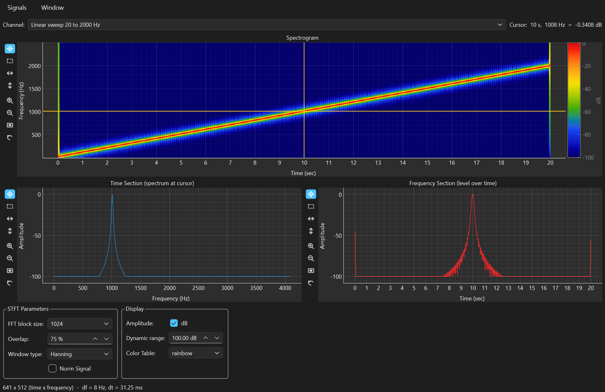
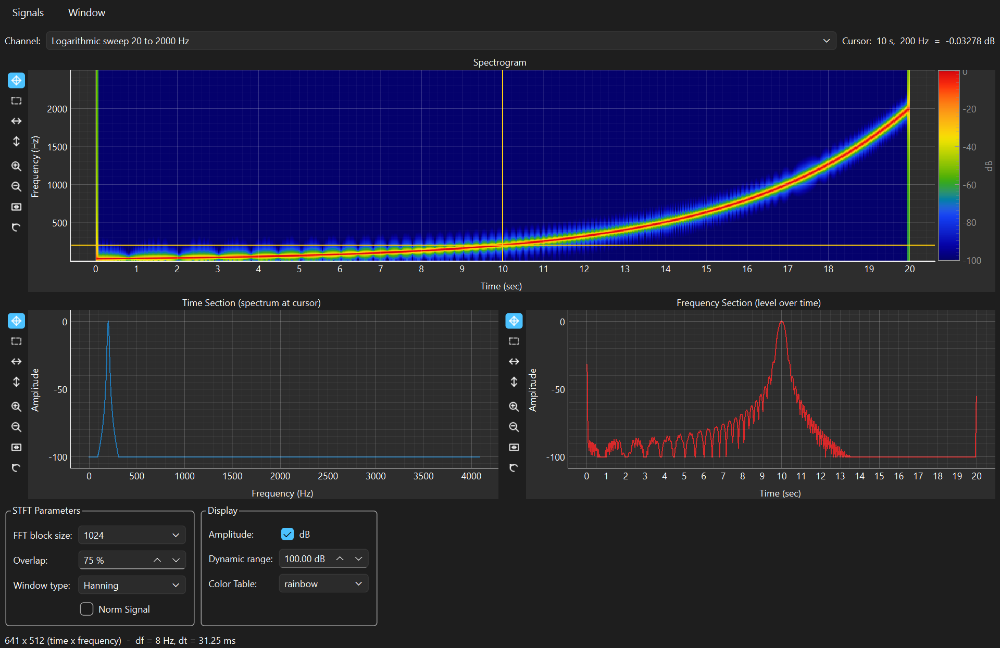
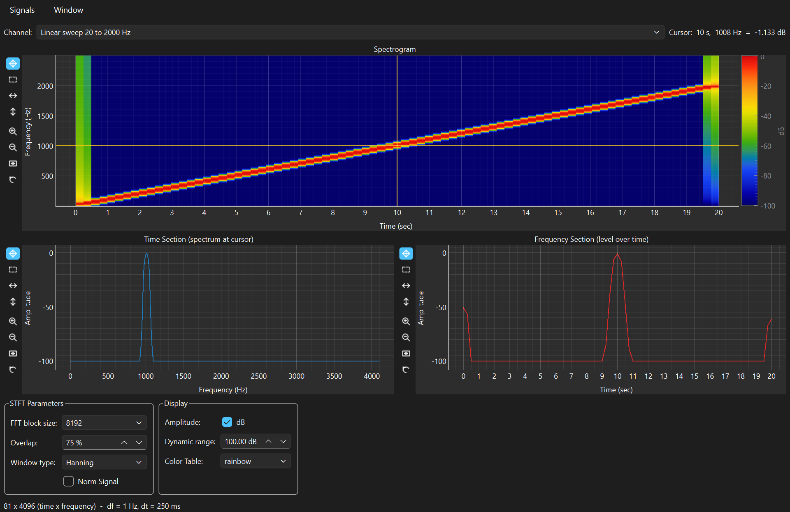
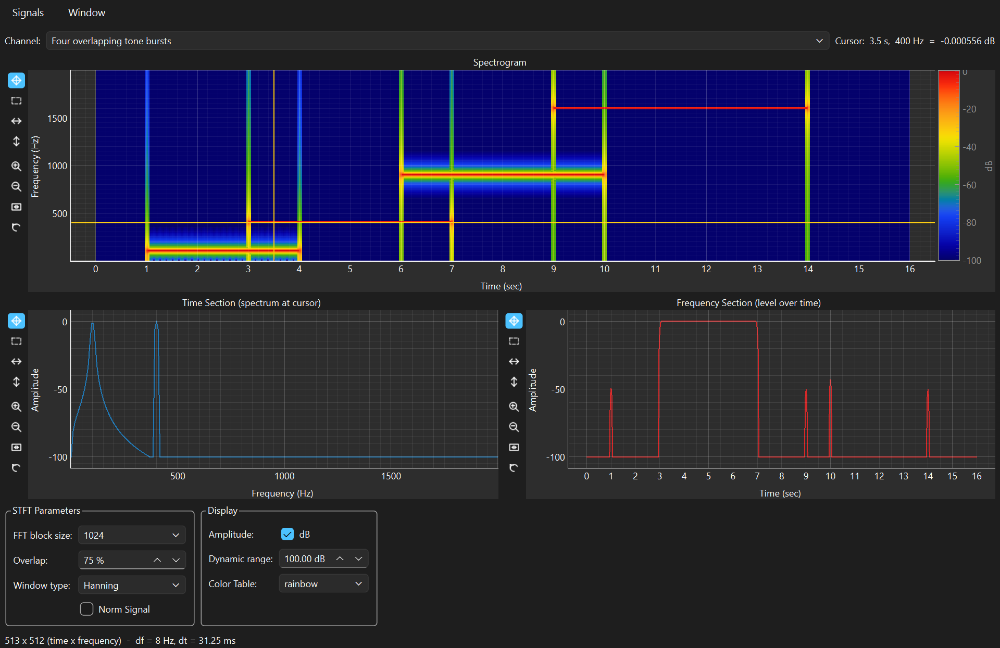

# Time-Frequency Analysis

A spectrum tells you which frequencies are in a recording. It does not tell
you *when*. For a steady signal that is no loss; for a machine running up, a
gear changing, a note being played, or anything that starts and stops, it
throws away the most interesting part.

The Time-Frequency window draws the answer as a picture: time across,
frequency up, level as colour. A cross-hair cursor cuts two sections
through it — the spectrum at one instant, and the level of one frequency
over the whole record.

Everything in this manual is worked on the demonstration files in `.data/`,
whose expected values are checked by `tools/verify_demo_data.py`. Every
number quoted below was produced by the application itself, not derived on
paper — so if a number here disagrees with your screen, that is a bug worth
reporting.

> **▶ Prefer to run it?** Every example here is also a section of the
> companion notebook,
> [**Time-Frequency — worked examples**](notebooks/time-frequency.ipynb),
> which GitHub renders with all its output and graphs. It computes the same
> numbers in a few lines of `spwb.processing` — no GUI, no Qt — and asserts
> each one. Its source is
> [`examples/manuals/time_frequency.py`](../../examples/manuals/time_frequency.py).

**Contents**

* [Where this comes from](#where-this-comes-from)
* [Getting the demo files](#getting-the-demo-files)
* [Opening the window](#opening-the-window)
* [A tour of the controls](#a-tour-of-the-controls)
* [Worked example 1 — a sweep is a diagonal](#worked-example-1--a-sweep-is-a-diagonal)
* [Worked example 2 — the trade you cannot avoid](#worked-example-2--the-trade-you-cannot-avoid)
* [Worked example 3 — the cursor, and reading a value off the picture](#worked-example-3--the-cursor-and-reading-a-value-off-the-picture)
* [Getting the numbers out](#getting-the-numbers-out)
* [The maths, and how it is pinned to LabVIEW](#the-maths-and-how-it-is-pinned-to-labview)
* [Tips and traps](#tips-and-traps)
* [The same analysis in a notebook](#the-same-analysis-in-a-notebook)
* [Reference tables](#reference-tables)

---

## Where this comes from

**Dennis Gabor drew this window in 1946.** His paper "Theory of
communication" — written before the holography that later won him the Nobel
Prize — asked what a signal *is*, and answered by refusing to choose between
the two descriptions on offer. A waveform gives you perfect time and no
frequency; a Fourier spectrum gives you perfect frequency and no time.
Gabor's move was to draw both on one plane, divide it into cells, and prove
something uncomfortable about them: a cell can be made narrow in time or
narrow in frequency, but the product of the two has a floor. You cannot
localise a signal arbitrarily well in both at once.

That is not a limitation of the algorithm, or of this software, or of your
computer. It is a property of what a frequency *means* — measuring one
requires watching for a while, and watching for a while is exactly what
blurs the timing. **The FFT block size control in this window is that
trade, exposed as a dropdown**, and [example 2](#worked-example-2--the-trade-you-cannot-avoid)
measures it.

**Meanwhile, Bell Labs had built the machine.** Through the war years Ralph
Potter's group developed the sound spectrograph, which dragged a filter
across a recording and burned the result onto paper with a sparking stylus,
producing the smudged grey-on-white images published in 1947 as *Visible
Speech*. The original purpose was to let deaf people see speech; what it
actually did was found modern phonetics, because for the first time you
could look at a vowel and see its formants sitting there. Every spectrogram
since — including this one — is that picture with the paper replaced by a
screen.

**The rest is engineering.** The short-time Fourier transform formalised
what the spectrograph did mechanically: chop the signal into overlapping
blocks, window each one, transform it, and stack the results into an image.
Overlap arrived because non-overlapping blocks miss events that straddle a
boundary. And when the fixed cell size finally became the binding
constraint, the answer was to let the cell change shape with frequency —
Jean Morlet, working on seismic traces at Elf in the late 1970s, and Alex
Grossmann, who put it on a formal footing, gave us wavelets for exactly that
reason. SPWB does not implement them; when you find yourself wanting a long
block at low frequency and a short one high up, that is the wish wavelets
grant.

<details>
<summary>Sources, if you want to check any of this</summary>

* D. Gabor, "Theory of communication", *Journal of the Institution of
  Electrical Engineers* 93, 1946 — the time-frequency plane and its
  uncertainty relation.
* R. K. Potter, G. A. Kopp and H. C. Green, *Visible Speech*, 1947 — the
  Bell Labs sound spectrograph.
* J. B. Allen and L. R. Rabiner, "A unified approach to short-time Fourier
  analysis and synthesis", *Proc. IEEE* 65, 1977.
* J. Morlet et al. on seismic wavelets, late 1970s–1982; A. Grossmann and
  J. Morlet, *SIAM J. Math. Anal.*, 1984.

</details>

---

## Getting the demo files

The datasets are generated rather than shipped, from a fixed seed, so
everyone's copy is identical:

* in the application, **File > Create Demo Data ...**;
* in a script, `from spwb.demo import write_demo_data`;
* from a checkout, `python tools/make_demo_data.py`.

---

## Opening the window

Load signals into a **Time Processing** window, tick what you want, then
**Analysis > Time Frequency Analysis ...** (`Ctrl+G`).

**This window analyses one signal at a time.** The **Channel** selector at
the top picks which — everything else in the window follows it. That is the
one structural difference from the FFT and Transfer Function windows, and it
follows the original front panel.

---

## A tour of the controls

`12_TFA_Sweeps_linear_and_log.h5`, linear sweep, everything at its default:



The layout is the panel's defining feature: the **Spectrogram** in the
middle, the **Time Section** bottom left, the **Frequency Section** bottom
right, and a **Cursor** readout top right.

### STFT Parameters

| Control | Default | What it does |
|---|---|---|
| **FFT block size** | **1024** | Both the window length and the FFT length. Sets frequency resolution *and* time smearing — the trade. Powers of two from 128 to 8192. |
| **Overlap** | **75 %** | How far blocks overlap. Sets the hop: at 75 % the frames step by a quarter of a block. Higher overlap gives a smoother picture, not more information. |
| **Window type** | Hanning | The taper on each block, same menu as the FFT window. |
| **Norm Signal** | off | Scale the signal to unit peak before analysing. Changes the absolute numbers, not the picture — see [Tips](#tips-and-traps). |

### Display

| Control | Default | What it does |
|---|---|---|
| **dB** | on | Show level in dB relative to the loudest point in the record. |
| **Dynamic range** | 100.00 dB | How far below the peak the colour scale reaches. Everything quieter is floored to the bottom colour. |
| **Color Table** | rainbow | rainbow, fire, gray or viridis. |

The display controls redraw instantly; the STFT parameters recompute.

### The cursor and the two sections

Click anywhere on the spectrogram, or drag either yellow line. The readout
gives the snapped position and the value there:

```
Cursor:  3.5 s,  400 Hz  =  -0.000556 dB
```

**Time Section** is the vertical cut: the spectrum at that instant, level
against frequency. **Frequency Section** is the horizontal cut: that one
frequency's level over the whole record.

### Status bar

```
513 x 512 (time x frequency)  -  df = 8 Hz, dt = 31.25 ms
```

Frames × bins, and the resolution actually achieved on both axes. Worth
reading every time you change the block size.

---

## Worked example 1 — a sweep is a diagonal

**File:** `12_TFA_Sweeps_linear_and_log.h5` — a tone sweeping 20 Hz to
2000 Hz over 20 s, linearly; and the same endpoints swept logarithmically.

With the defaults the status bar reports **641 × 512**, `df = 8 Hz`,
`dt = 31.25 ms`, and the picture is a straight line from bottom left to top
right. Follow the ridge and read the peak bin at each moment:

| Time | Peak bin | Expected (20 + 99·t) | Error |
|---|---|---|---|
| 0.0 s | 24 Hz | 20 Hz | +4 |
| 2.5 s | 264 Hz | 267.5 Hz | −3.5 |
| 5.0 s | 512 Hz | 515 Hz | −3 |
| 10.0 s | 1008 Hz | 1010 Hz | −2 |
| 15.0 s | 1504 Hz | 1505 Hz | −1 |
| 19.0 s | 1904 Hz | 1901 Hz | +3 |

A straight-line fit through the peak bin of **every** frame — not just the
six sampled above — gives **99.00 Hz/s** with an intercept of **20.0 Hz**,
against the file's stated 20 Hz to 2000 Hz in 20 s, which is 99.0 Hz/s
exactly. And every error in the table is **smaller than half a bin**
(df = 8 Hz, so ±4 Hz is the best any bin-peak reading can do). The
measurement is as accurate as the grid allows.

Now switch **Channel** to the logarithmic sweep:



| Time | Linear sweep | Log sweep |
|---|---|---|
| 0 s | 24 Hz | 24 Hz |
| 2.5 s | 264 Hz | 32 Hz |
| 5 s | 512 Hz | 64 Hz |
| 10 s | 1008 Hz | 200 Hz |
| 15 s | 1504 Hz | 632 Hz |
| 19 s | 1904 Hz | 1592 Hz |

Same start, same end, completely different journey. The log sweep spends
equal time per *octave* rather than per hertz — 64 Hz at 5 s, 128 Hz around
7 s, 256 Hz around 9 s. It looks slow and then sudden on a linear frequency
axis, which is exactly why it is the standard acoustic measurement sweep:
it puts equal measurement effort into each octave, which is how rooms and
loudspeakers actually behave.

---

## Worked example 2 — the trade you cannot avoid

Same file, same signal, one control. **FFT block size** sets both axes'
resolution at once, in opposite directions:

| Block size | df | dt (frames) | Time smear | Frames × bins |
|---|---|---|---|---|
| 128 | 64 Hz | 3.9 ms | 15.6 ms | 5121 × 64 |
| 256 | 32 Hz | 7.8 ms | 31.2 ms | 2561 × 128 |
| 512 | 16 Hz | 15.6 ms | 62.5 ms | 1281 × 256 |
| **1024** | **8 Hz** | **31.3 ms** | **125 ms** | **641 × 512** |
| 2048 | 4 Hz | 62.5 ms | 250 ms | 321 × 1024 |
| 4096 | 2 Hz | 125 ms | 500 ms | 161 × 2048 |
| 8192 | 1 Hz | 250 ms | 1000 ms | 81 × 4096 |

Read the first and last columns together. Every doubling of the block halves
`df` and doubles the time smear — the product is constant. In fact
**df × (block length in seconds) = 1, exactly**, in every row. That is
Gabor's uncertainty relation, and no setting escapes it.

Here is the longest block on the same sweep:



The ridge is now a *thick* diagonal. Frequency is pinned to 1 Hz, but each
frame averages a full second of a signal whose frequency moves 99 Hz in that
time — so the tone is genuinely spread across ~99 bins while it is being
measured. Compare with block 128, where the line is razor-thin in time and
64 Hz wide in frequency.

**How to choose:**

* **Short blocks (128–512)** for transients, impacts, clicks, and anything
  where *when* matters more than *what*.
* **Long blocks (2048–8192)** for slowly varying tones, resolving two close
  frequencies, and steady machinery.
* **1024 is a reasonable default** for audio at 8–48 kHz, which is why it is
  the default.
* **If the thing you are looking at is changing fast, a longer block will
  not help** — it will smear the answer and look more confident while being
  less true.

**Overlap is not a substitute.** Raising it from 75 % to 90 % gives more
frames and a smoother-looking image, but each frame still averages the same
block length. It interpolates the picture; it does not sharpen it.

---

## Worked example 3 — the cursor, and reading a value off the picture

**File:** `13_TFA_Tone_bursts.h5` — four tones switching on and off with
deliberate overlaps: 100 Hz from 1–4 s, 400 Hz from 3–7 s, 900 Hz from
6–10 s, 1600 Hz from 9–14 s. On a spectrogram they are four rectangles.

Put the cursor at **t = 3.5 s, 400 Hz**:



The **Time Section** shows **two peaks** — 100 Hz and 400 Hz — because at
3.5 s those are the two tones alive. That is the file's headline claim, and
it holds:

| Frequency | Level at t = 3.5 s |
|---|---|
| 100 Hz | −1.42 dB |
| **400 Hz** | **0.00 dB** |
| 900 Hz | −100 dB (the floor) |
| 1600 Hz | −100 dB (the floor) |

The **Frequency Section** shows the 400 Hz tone alive from **2.969 s to
7.031 s**, against a true 3–7 s. The 31 ms of overshoot at each end is the
block smearing the edges — a 1024-sample block is 125 ms long, so it starts
to see the tone before the tone formally begins.

Run the same check across the record and the detection matches the file's
plan at every instant:

| Cursor time | Above −40 dB | Actually on |
|---|---|---|
| 0.5 s | none | none |
| 2.0 s | 100 | 100 |
| 3.5 s | 100, 400 | 100, 400 |
| 6.5 s | 400, 900 | 400, 900 |
| 9.5 s | 900, 1600 | 900, 1600 |
| 12.0 s | 1600 | 1600 |
| 15.0 s | none | none |

### Why 100 Hz reads −1.42 dB and 400 Hz reads 0.00

Both tones have the same amplitude, so why does one read 1.42 dB low?

Because **100 Hz is not on the bin grid.** With `df = 8 Hz` the bins are
0, 8, 16 … 96, 104 — and 100 Hz falls exactly halfway between two of them.
The cursor snaps to 96 Hz and reads a tone that has been split between
neighbours. 400 Hz and 1600 Hz are exact multiples of 8 and land dead
centre; 100 Hz and 900 Hz do not.

This is the same scalloping loss the
[FFT manual](fft-analysis.md#worked-example-2--leakage-and-what-the-window-is-for)
measures as a Hanning window under-reading an off-bin tone to 0.849 of its
true amplitude. In power terms 0.849² = 0.721, and 10·log₁₀(0.721) =
**−1.42 dB**. The same number, in the same window, wearing different units.

**And it has a fix here.** Change the block size to 2048 and `df` becomes
4 Hz — which *does* divide 100 — and the same tone reads **0.00 dB**:

| | df = 8 Hz (block 1024) | df = 4 Hz (block 2048) |
|---|---|---|
| 100 Hz | bin 96 Hz, −1.42 dB | bin 100 Hz, **0.00 dB** |
| 400 Hz | bin 400 Hz, 0.00 dB | bin 400 Hz, 0.00 dB |

If you are reading levels off a spectrogram rather than just looking at the
shape, check that the frequency you care about is a multiple of `df`.

### The vertical stripes are real

Look at the spectrogram at 1, 3, 4, 6, 7, 9, 10 and 14 seconds: thin bright
columns spanning every frequency. Those are not artefacts of the display.
Switching a tone on instantly is a step, and a step is broadband — the
bursts in this file gate abruptly, so each transition genuinely radiates
across the spectrum. Real machinery does the same thing at every impact.

---

## Getting the numbers out

**Signals > Export sections to clipboard** copies both cross-sections at
the current cursor as tab-separated text: the Time Section as frequency
against level, then the Frequency Section as time against level, each with
its own header. Paste into a spreadsheet.

The spectrogram itself is not exported as a table — it is an image of up to
several million numbers. If you need the array, use the
[notebook route](#the-same-analysis-in-a-notebook), where `spectrogram.data`
is an ordinary NumPy array of shape (frames, bins).

---

## The maths, and how it is pinned to LabVIEW

From `Time Frequency Analysis (V1.25).vit` and NI's STFT:

1. **Centre-align the frames.** The signal is padded by half a block at the
   front, so frame *i* is centred on sample *i*·hop rather than starting
   there. That is why the time axis starts at 0 s rather than half a block
   in, and why the first frame is meaningful.
2. **Window and transform each block**, taking `|X(k)|²` for the first
   `block/2` bins.
3. **Normalise by `Σw² · block`**, so the result is a power spectrogram
   whose values do not change when you change the window or block size for
   the same steady signal.
4. **Axes:** `times = t0 + i·hop·dt`, `freqs = k·fs/block`. Hence
   `df = fs/block` and `dt = hop/fs`.

**dB is relative to the record's own peak**, floored `dynamic_range` below
it. That is why the loudest point of any spectrogram reads 0.00 dB and the
scale runs to −100: it is a *relative* display, not an absolute level. Two
spectrograms of different recordings are not directly comparable by colour.

**None of these numbers were re-derived.** The test suite compares them
against reference data generated by driving LabVIEW 2022 itself over COM,
committed in `tests/fixtures/`.

---

## Tips and traps

**Read the status bar after every block-size change.** `df` and `dt` are
the two numbers that decide whether what you are looking at means anything.

**A frequency you care about should be a multiple of `df`.** Otherwise you
are reading a scalloped value — up to 1.42 dB low with a Hanning window.

**dB is relative to the peak of *this* record.** A quiet recording and a
loud one both top out at 0.00 dB. Do not compare two spectrograms by
colour; compare the numbers in the sections.

**Dynamic range is a display control, not an analysis one.** Lowering it
from 100 dB to 60 dB does not remove noise, it just stops drawing it. That
is often exactly what you want — the default 100 dB frequently shows more
floor than signal.

**Norm Signal changes the numbers, not the picture.** It scales the signal
to unit peak, which divides every power value by the peak squared — on file
13, by 3.985. Since the dB display is relative to each record's own peak,
the dB image is *identical* either way. It matters if you read linear
amplitudes; it does not if you read dB.

**Overlap smooths, it does not sharpen.** More frames of the same block
length is interpolation.

**One channel at a time.** To compare two signals, open a second window
with `Ctrl+N`.

---

## The same analysis in a notebook

Everything above is the GUI driving a library that has no idea Qt exists.
All three examples are worked in code in the companion notebook —
[**Time-Frequency — worked examples**](notebooks/time-frequency.ipynb),
source at
[`examples/manuals/time_frequency.py`](../../examples/manuals/time_frequency.py).
Run it with:

```bash
python examples/manuals/time_frequency.py
```

In miniature:

```python
import numpy as np
from spwb.processing.dsp.timefreq import stft_spectrogram
from spwb.processing.io import read_hdf5

signal = {s.name: s for s in read_hdf5(
    "demo-data/13_TFA_Tone_bursts.h5")}["Four overlapping tone bursts"]

spec = stft_spectrogram(signal, block_size=1024, hop=256, window="hanning")
print(spec.n_frames, spec.n_bins, spec.df, spec.dt)   # 513 512 8.0 0.03125

db = spec.to_db(dynamic_range=100.0)          # the panel's dB toggle
section = db.time_section(3.5)                # the Time Section at t = 3.5 s
print(float(section.y[np.argmin(np.abs(spec.freqs - 400))]))   # -0.0005...

over_time = db.frequency_section(400.0)       # the Frequency Section
print(over_time.name)     # 'Four overlapping tone bursts @ 400 Hz'
```

`spec.data` is a plain NumPy array of shape (frames, bins), so anything you
would normally do to an image — thresholding, ridge tracking, summing bands
— works directly.

---

## Reference tables

### FFT block size

`df = fs / block`, and the block spans `block / fs` seconds. At fs = 8192 Hz:

| Block | df | Block length | Use for |
|---|---|---|---|
| 128 | 64 Hz | 15.6 ms | Impacts, clicks, fast transients |
| 256 | 32 Hz | 31.2 ms | |
| 512 | 16 Hz | 62.5 ms | Speech-rate events |
| **1024** | **8 Hz** | **125 ms** | **General default** |
| 2048 | 4 Hz | 250 ms | |
| 4096 | 2 Hz | 500 ms | Close tones, steady machinery |
| 8192 | 1 Hz | 1000 ms | Fine frequency detail on stationary signals |

### Overlap and the hop

| Overlap | Hop (block 1024) | Frames over 16 s at 8192 Hz |
|---|---|---|
| 0 % | 1024 | 129 |
| 50 % | 512 | 257 |
| **75 %** | **256** | **513** |
| 90 % | 102 | 1286 |

### Colour tables

`rainbow`, `fire`, `gray`, `viridis` — the first three are the original
panel's; `viridis` is added here because it is perceptually uniform and
survives being printed in greyscale.

### Demo files used in this manual

| File | Shows |
|---|---|
| `12_TFA_Sweeps_linear_and_log.h5` | Sweeps as diagonals; linear vs logarithmic; the block-size trade |
| `13_TFA_Tone_bursts.h5` | Overlapping bursts; the cursor and both sections; scalloping on the bin grid |

Confirm every value in this manual with `python tools/verify_demo_data.py`.
