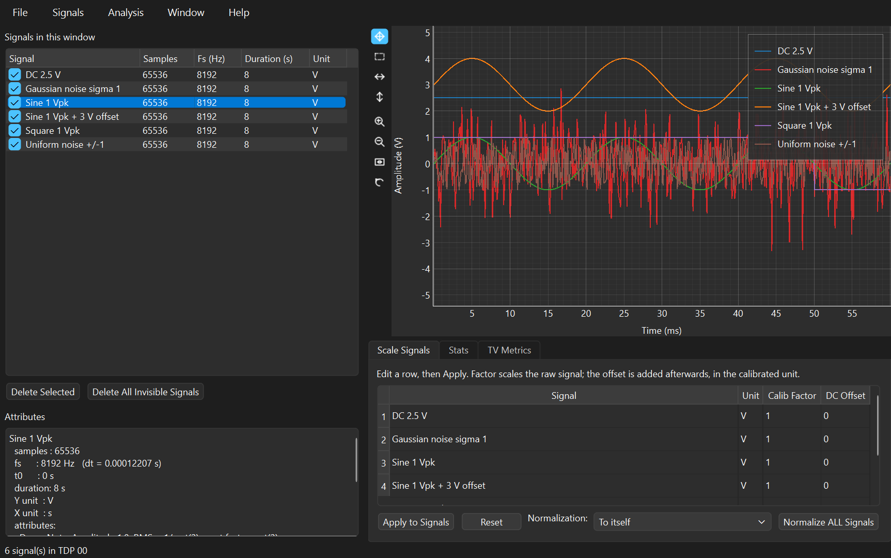
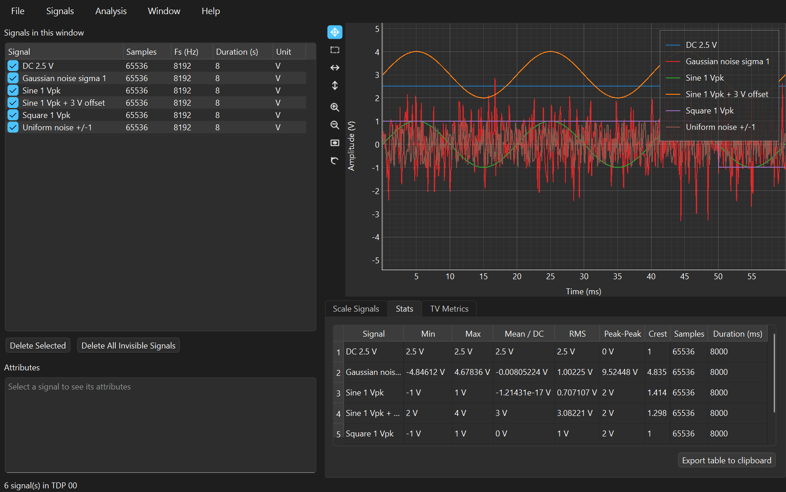
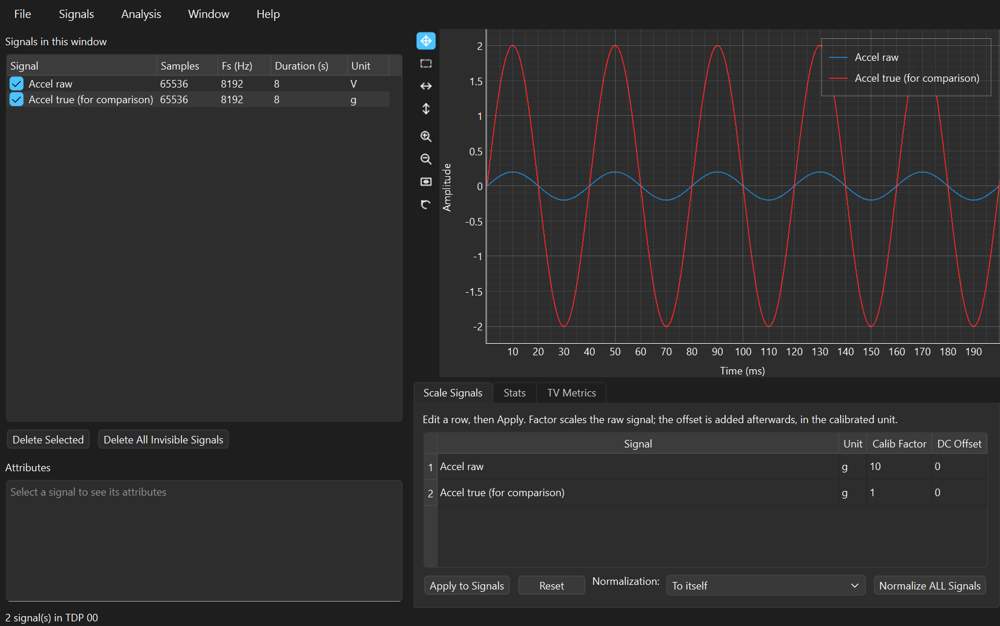
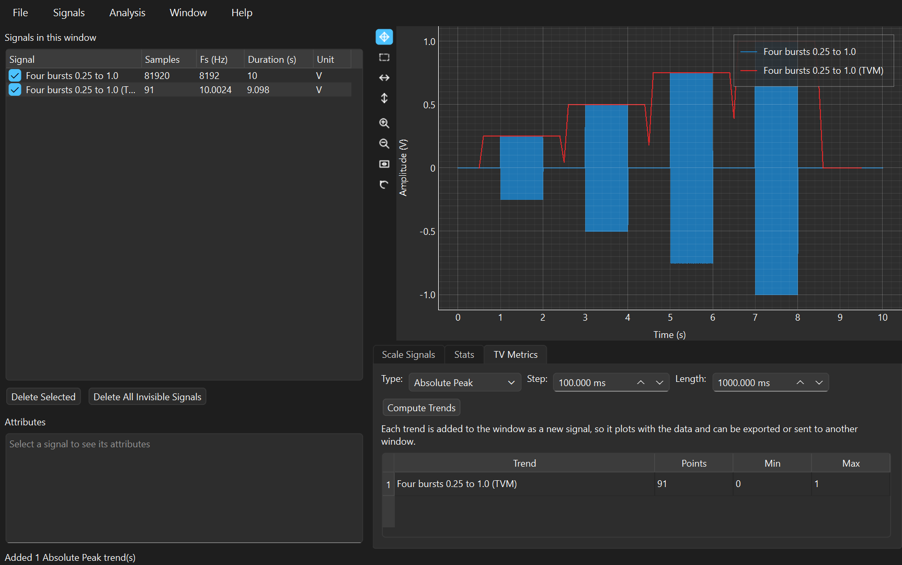

# Time Processing

The Time Processing window is where SPWB starts. It opens when you launch
the application, it is where files are loaded and saved, and it is the
window that hands signals to every analysis tool. It also does the work
that has to happen *before* any analysis is worth doing: turning raw volts
into engineering units, removing an offset, and checking that a recording
contains what you think it contains.

Everything in this manual is worked on the demonstration files in `.data/`,
whose expected values are checked by `tools/verify_demo_data.py`. Every
number quoted below was produced by the application itself, not derived on
paper — so if a number here disagrees with your screen, that is a bug worth
reporting.

> **▶ Prefer to run it?** Every example here is also a section of the
> companion notebook,
> [**Time Processing — worked examples**](notebooks/time-processing.ipynb),
> which GitHub renders with all its output and graphs. It computes the same
> numbers in a few lines of `spwb.processing` — no GUI, no Qt — and asserts
> each one. Its source is
> [`examples/manuals/time_processing.py`](../../examples/manuals/time_processing.py).

**Contents**

* [Where this comes from](#where-this-comes-from)
* [Getting the demo files](#getting-the-demo-files)
* [A tour of the window](#a-tour-of-the-window)
* [Worked example 1 — statistics you can check](#worked-example-1--statistics-you-can-check)
* [Worked example 2 — calibration, or making volts mean something](#worked-example-2--calibration-or-making-volts-mean-something)
* [Worked example 3 — trends, when one number is not enough](#worked-example-3--trends-when-one-number-is-not-enough)
* [Sending signals to an analysis window](#sending-signals-to-an-analysis-window)
* [Getting the numbers out](#getting-the-numbers-out)
* [The maths, and how it is pinned to LabVIEW](#the-maths-and-how-it-is-pinned-to-labview)
* [Tips and traps](#tips-and-traps)
* [The same analysis in a notebook](#the-same-analysis-in-a-notebook)
* [Reference tables](#reference-tables)

---

## Where this comes from

Nothing in this window is modern. Every number on the Stats tab was worked
out by people who needed it for a specific, concrete problem, and the
reasons are still the reasons.

**RMS, and the argument about alternating current.** In the 1880s the
question of whether electricity should be distributed as direct or
alternating current was commercial as much as technical, and it had an
awkward measurement problem underneath it: what does it even mean to say an
alternating voltage "is" 110 volts, when it spends most of its time
somewhere else and is zero twice a cycle? The answer that stuck was
thermal — the *effective* value is the steady direct current that would heat
a resistor at the same rate. Because heating goes as the square of the
current, that is the square root of the mean of the square, and the hot-wire
instruments of the period computed it directly by letting the current warm a
wire and measuring how far it sagged. A century and a half later, the RMS
column here is still that: the number that says how much the signal is
really doing.

**Crest factor, and listening to machines.** Divide the peak by the RMS and
you get a pure number that says nothing about size and everything about
shape. A sine is always 1.414; a square wave is exactly 1.000; a signal
made mostly of brief spikes on a quiet background can be 5 or 10. That
made it the first cheap diagnostic in machinery condition monitoring: a
healthy bearing produces broadly random vibration, and a damaged one adds
an impact every time a rolling element passes the fault, which lifts the
peak while barely moving the RMS. You could watch a bearing degrade on a
meter that cost almost nothing, and people did.

**Kurtosis, borrowed from statistics and put to work.** Karl Pearson gave
the shape statistics their names around the turn of the twentieth century —
"standard deviation" in 1893, "kurtosis" a decade later, from the Greek for
bulging — as tools for describing distributions in biology and heredity.
They arrived in vibration work much later, and by a specific route: Dyer
and Stewart's 1978 paper on detecting rolling-element bearing damage by
statistical analysis showed that the fourth moment picked up impulsive
damage earlier and more reliably than RMS did. Gaussian noise has a
kurtosis of exactly 3, and anything spikier reads higher, so the metric
answers "is this signal unusually impulsive?" without you having to say
what counts as unusual. That is why an eighteenth-century-flavoured
statistic sits in a vibration analyser's menu.

**Sensitivity, and why raw volts are useless.** A transducer does not
measure acceleration; it produces a charge or a voltage that is
*proportional* to acceleration, and the constant of proportionality is a
property of that individual device. Piezoelectric accelerometers became
practical instruments in the 1940s and 50s — Brüel & Kjær, founded in
Copenhagen in 1942, built much of the measurement culture around them — but
they had a problem: their output is a tiny charge, and every metre of cable
you add changes the reading. Walter Kistler's charge amplifier, patented in
1950, solved it by making the measurement depend on the charge rather than
the voltage, so cable length stopped mattering and the sensitivity printed
on the calibration sheet became a number you could actually trust. The
**Scale Signals** tab is where that number is entered. A recording without
it is a picture of a waveform; with it, it is a measurement.

**Trends, because one number describes only a steady signal.** All of the
above assume the signal is doing the same thing throughout. Real records
are not like that — a machine runs up, a test article is loaded until it
fails, a bearing degrades over a week. The response is the same one that
underlies the spectrogram in the Time-Frequency window: stop computing over
the whole record, slide a short window along it, and plot the answer against
time. The **TV Metrics** tab does this for any of the seven statistics, and
because a trend is itself just a signal sampled more slowly, SPWB adds it to
the window as one — so it plots against the data it came from, and can be
analysed, exported or sent onward like anything else.

<details>
<summary>Sources, if you want to check any of this</summary>

* On effective/RMS values and thermal measurement of alternating current,
  any history of the "war of the currents" period; hot-wire ammeters date
  from the 1880s.
* K. Pearson, "Contributions to the mathematical theory of evolution",
  *Philosophical Transactions*, 1890s, and *Biometrika*, 1905, for the
  naming of standard deviation and kurtosis.
* R. Dyer and R. M. Stewart, "Detection of rolling element bearing damage
  by statistical vibration analysis", *ASME Journal of Mechanical Design*
  100, 1978.
* W. P. Kistler's charge amplifier, patented 1950, is the reason
  piezoelectric sensitivity figures are usable in practice; Brüel & Kjær
  was founded in 1942.

</details>

---

## Getting the demo files

The datasets are generated rather than shipped, from a fixed seed, so
everyone's copy is identical. Three ways, all producing the same files:

* in the application, **File > Create Demo Data ...**, which asks where to
  put them — no checkout needed, this works from `pip install spwb[gui]`;
* in a script or notebook,
  `from spwb.demo import write_demo_data; write_demo_data("demo-data")`;
* from a source checkout, `python tools/make_demo_data.py`, which fills the
  repository's own `.data/`.

Then **File > Open ... > SPWB / HDF5 (\*.h5, \*.hdf5)** (`Ctrl+O`).

---

## A tour of the window

This is the window with `01_TimeProcessing_Stats_known_values.h5` loaded
and a signal selected:



### The signal list

| Column | Meaning |
|---|---|
| **Signal** | Name. The checkbox shows and hides its curve, and controls what the analysis windows receive. |
| **Samples** | Number of points. |
| **Fs (Hz)** | Sample rate. |
| **Duration (s)** | Length of the record. |
| **Unit** | Engineering unit — what the **Scale Signals** tab sets. |

Columns can be dragged wider and reordered, and the window remembers both.
**Delete Selected** removes the highlighted signals; **Delete All Invisible
Signals** clears everything unticked, which is the quick way to tidy up
after an experiment.

### The Attributes panel

Underneath the list, and the reason the demo files are worth using: it
shows the selected signal's attributes, and the demo signals carry their
own expected results. Selecting *Sine 1 Vpk* shows that its RMS should be
0.707107 and its crest factor 1.414214, right beside the Stats tab that
computes them. The divider between the list and this panel can be dragged,
including shut.

Attributes travel with the signal — through analysis, export and reload —
so a measurement can carry its transducer serial number, test point and
date for as long as the file exists.

### The plot

The toolbar down the left is the tool palette SPWB's LabVIEW front panels
had. The top four choose what dragging does — **Pan**, **Zoom** to a
rectangle, **Zoom X** and **Zoom Y** — and only one is active at a time.
The four below are one-shot buttons: zoom in, zoom out, **fit to all
data**, and undo the last zoom.

**To set an exact limit, double-click the first or last number on an axis**
and type the one you want. That is the LabVIEW gesture, and it is the only
way to get an exact edge with the mouse — every drag tool lands somewhere
approximate. A value that would put the minimum above the maximum is
refused and the old one stays, but limits *beyond the data* are allowed
deliberately, so you can leave headroom around a signal. On a logarithmic
axis you type the real frequency, not its logarithm. Setting a limit turns
off autoscale for that axis; **fit to all data** turns it back on.

### Scale Signals tab

Per-signal **Unit**, **Calib Factor** and **DC Offset**, plus the signal's
name. Edits are *staged*: nothing changes until **Apply to Signals**, so a
half-typed `9.81` never scales anything by 9. **Reset** discards staged
edits. **Normalize ALL Signals** applies the chosen normalisation to
everything at once — see [example 2](#worked-example-2--calibration-or-making-volts-mean-something).

### Stats tab

One row per signal: **Min**, **Max**, **Mean / DC**, **RMS**,
**Peak-Peak**, **Crest**, **Samples**, **Duration (ms)**. Read-only, and
**Export table to clipboard** copies it as tab-separated text.

Note what is *not* here: standard deviation, skewness and kurtosis are on
the **TV Metrics** tab, because SPWB treats them as trends rather than
single figures. See [Tips](#tips-and-traps).

### TV Metrics tab

**Type** (seven trends), **Step** and **Length** in milliseconds, and
**Compute Trends**. Each trend is added to the window as a new signal named
`... (TVM)`, and the summary table reports **Points**, **Min** and **Max**
for each.

### Menus

| Menu | Contents |
|---|---|
| **File** | Open ... and Save ... submenus (HDF5, TDMS, WAV, CSV, plus read-only RPC-III, Nastran punch and HEAD acoustics), **Create Demo Data ...**, Exit |
| **Signals** | Create ... (synthesise a signal), Import Signals ... from another window or a file |
| **Analysis** | Spectrums (FFT) `Ctrl+F`, Transfer Functions `Ctrl+T`, Time Frequency Analysis `Ctrl+G`, Adaptive Filtering (LMS) `Ctrl+L` |
| **Window** | New and duplicate windows |
| **Help** | **Time Processing Manual** (`F1`) — this page, All User Manuals ..., About SPWB |

Every analysis window carries the same **Help** menu, and `F1` is
context-sensitive: it opens the manual for the window you are in. The
other four are always one entry below, under **All User Manuals ...**.

---

## Worked example 1 — statistics you can check

**File:** `01_TimeProcessing_Stats_known_values.h5` — six signals whose
statistics are all textbook values, sampled at 8192 Hz for 8 s.

Open it and click the **Stats** tab:



| Signal | Min | Max | Mean / DC | RMS | Peak-Peak | Crest |
|---|---|---|---|---|---|---|
| DC 2.5 V | 2.5000 | 2.5000 | 2.5000 | 2.5000 | 0.0000 | 1.0000 |
| Sine 1 Vpk | −1.0000 | 1.0000 | −0.0000 | **0.7071** | 2.0000 | **1.4142** |
| Square 1 Vpk | −1.0000 | 1.0000 | 0.0000 | **1.0000** | 2.0000 | **1.0000** |
| Gaussian noise sigma 1 | −4.8461 | 4.6784 | −0.0081 | 1.0023 | 9.5245 | 4.8352 |
| Uniform noise +/−1 | −1.0000 | 0.9999 | −0.0009 | **0.5798** | 1.9998 | 1.7245 |
| Sine 1 Vpk + 3 V offset | 2.0000 | 4.0000 | 3.0000 | 3.0822 | 2.0000 | 1.2978 |

Every bolded value is one you can derive on paper:

* a sine of amplitude 1 has RMS 1/√2 = **0.707107** and crest factor
  √2 = **1.414214**;
* a square wave is at its peak the whole time, so RMS equals peak and the
  crest factor is exactly **1** — the lowest any signal can have;
* uniform noise on [−1, 1] has RMS 1/√3 = **0.577350**; the measured 0.5798
  differs in the third decimal because this is one finite sample of a random
  process, not the process itself;
* the Gaussian signal's crest factor of 4.8 is not a fault — Gaussian noise
  has no bounded peak, so the largest sample in a record depends on how long
  the record is. Crest factor is only meaningful compared against *the same
  measurement on the same machine over time*.

**The one that surprises people.** *Sine 1 Vpk + 3 V offset* reads an RMS of
**3.0822**, not 3.0 and not 0.707. A DC component and an AC component add in
quadrature: √(3² + 0.5) = 3.082207. The RMS of a signal with an offset tells
you almost nothing about the part you care about, which is why the next
example exists.

**Fix it in the Scale Signals tab.** Set that signal's **DC Offset** to
`−3` and press **Apply to Signals**. The Stats tab then reads mean −0.000000
and RMS 0.707107 — the sine on its own, exactly as if the offset had never
been there.

---

## Worked example 2 — calibration, or making volts mean something

**File:** `03_TimeProcessing_Calibration_raw_volts.h5` — an accelerometer
recording in raw volts from a sensor of 100 mV/g, and the same signal
already converted to g so you can check your work.

The raw signal peaks at **0.200000 V**. That number is not wrong, it is
just not the measurement: at 100 mV/g the sensor produces 0.1 V for every
1 g, so the acceleration is 0.2 / 0.1 = 2 g. The **Calib Factor** is the
reciprocal of the sensitivity — **10** — and the **Unit** becomes `g`:



Press **Apply to Signals** and the Stats tab reads:

| | Max | RMS | Unit |
|---|---|---|---|
| Accel raw, before | 0.200000 | 0.141421 | V |
| **Accel calibrated** | **2.000000** | **1.414214** | **g** |
| Accel true (for comparison) | 2.000000 | 1.414214 | g |

The calibrated signal matches the reference to **2.2 × 10⁻¹⁶** — floating
point, not arithmetic. The plot's legend and axis relabel themselves,
because units are carried by the signal rather than set on the graph.

**The order matters.** The factor multiplies the raw signal, and the offset
is added *afterwards*, in the calibrated unit. So a sensor of 100 mV/g
sitting on a 0.05 V bias is factor 10, offset −0.5 g — not offset −0.05.
The tab's help line says this above the table, because getting it backwards
is silent and produces a plausible-looking wrong answer.

**Applying it leaves a record.** The calibrated signal gains
`Scale_Factor`, `DC_Offset` and `Channel Unit` attributes, visible in the
Attributes panel, so six months later the file still says what was done to
it.

### Normalisation

The **Normalization** control beside **Apply** rescales everything at once,
for when you want to compare shapes rather than levels. With a 1 V sine, a
1 V square and a 2.5 V DC signal loaded:

| Option | Resulting peaks | What it preserves |
|---|---|---|
| None | 1.0, 1.0, 2.5 | Everything — it is the no-op |
| **To itself** | 1.0, 1.0, 1.0 | Shape only. Every signal fills the plot; **relative levels are destroyed** |
| **To the max levels of ALL the signals** | 0.4, 0.4, 1.0 | Relative levels — everything is divided by the largest peak in the set (2.5) |

Use the second when you want to see the shape of a small signal beside a
large one; use the third when the difference in size is part of what you are
looking at. Normalisation overwrites the signals in the window, so reload
the file to undo it.

---

## Worked example 3 — trends, when one number is not enough

**File:** `02_TimeProcessing_TVmetrics_trends.h5` — three 10-second signals
designed so the right trend has an obvious shape: an amplitude ramp, four
one-second bursts at 25/50/75/100 %, and a steady reference.

Load it, show only *Four bursts 0.25 to 1.0*, open **TV Metrics**, set
**Type** to `Absolute Peak`, and press **Compute Trends**:



The red trace is the trend, added to the window as a signal in its own
right. It climbs a staircase — **0.25, 0.50, 0.75, 1.00** — one step per
burst, which is exactly what the file promises.

Look at the signal list while you are here: the trend has **91 points** at
**10.0024 Hz** over **9.098 s**, against 81920 points at 8192 Hz over 10 s
for the data. It is a signal like any other, only sampled far more slowly.

### Three things about that trend which are not mistakes

**The trend is shorter than the signal.** 9.098 s, not 10. Each point needs
a full window of data, so the last one starts 1 second before the end. A
sliding-window trend can never cover the whole record.

**The step is not exactly what you asked for.** You asked for 100 ms and
got 99.9756 ms, because the step has to be a whole number of samples:
round(0.1 × 8192) = 819 samples, and 819/8192 = 0.0999756 s. The same
constraint as the FFT window's frequency resolution, for the same reason.

**The edges of the staircase slope.** When the window straddles the moment a
burst starts, it contains some burst and some silence, so the trend passes
through intermediate values. A window of 1000 ms cannot resolve an event
faster than 1000 ms. Shorten **Length** to sharpen the corners, at the cost
of a noisier trend — that is the whole trade, and it is the same one the
Time-Frequency window makes.

### The other two signals, and what each trend is for

On the **amplitude ramp**, an RMS trend rises in a straight line from
0.04083 to 0.67200 — a ramp, as promised. It does not reach 1/√2 = 0.7071
for the reason above: the last window ends a second early, where the
envelope has not yet reached full height.

On the **steady 0.5 Vpk reference**, every trend is flat — the spread across
the whole record is around 10⁻¹⁶, which is floating-point noise rather than
a measurement. That makes it the right signal for reading off what each
trend type actually computes:

| Trend | Steady 0.5 Vpk sine | Why |
|---|---|---|
| RMS | 0.353553 | 0.5/√2 |
| Absolute Peak | 0.500000 | The amplitude |
| Range | 1.000000 | Peak-to-peak, +0.5 to −0.5 |
| Standard Deviation | 0.353575 | The RMS about the mean — see below |
| Variance | 0.125015 | The square of it |
| Skewness | −0.000000 | A sine is symmetric |
| **Kurtosis** | **1.499634** | The textbook value for a sine is exactly **1.5** |

**Standard deviation reads very slightly above RMS**, 0.353575 against
0.353553, and that is not an error. For a zero-mean signal the two are the
same quantity, but SPWB follows NI's convention of dividing by N − 1 rather
than N (Bessel's correction), which multiplies the result by
√(8192/8191) = 1.000061. Multiply 0.353553 by that and you get 0.353575
exactly.

**And this is where the shape statistics earn their place.** Run
*Standard Deviation*, *Skewness* and *Kurtosis* on the Gaussian noise signal
from example 1 and the medians come out at **1.00468**, **−0.00534** and
**2.96297** — against textbook values of 1, 0 and 3 for a normal
distribution. A kurtosis near 3 says "this is ordinary noise". The reason
anyone watches that number on a machine is that a developing bearing fault
pushes it upward long before the RMS moves.

---

## Sending signals to an analysis window

Tick the signals you want, then pick from the **Analysis** menu:

| Menu entry | Shortcut | Window |
|---|---|---|
| Spectrums (FFT) ... | `Ctrl+F` | [FFT Analysis](fft-analysis.md) |
| Transfer Functions ... | `Ctrl+T` | Transfer Function |
| Time Frequency Analysis ... | `Ctrl+G` | Time-Frequency |
| Adaptive Filtering (LMS) ... | `Ctrl+L` | Adaptive Filtering |

Selected signals are sent; if nothing is selected, everything visible goes.
This is the multi-window signal sharing the LabVIEW original was known for,
and it works in both directions — any window can pull signals from any
other with **Import Signals ... > Another Window**.

Because a trend is a signal, you can send one to an FFT window and take the
spectrum of a trend. That is not a curiosity: a bearing fault that
modulates the RMS at shaft rate shows up as a peak in the spectrum *of the
RMS trend*.

---

## Getting the numbers out

* **Export table to clipboard** on the Stats tab copies the whole table as
  tab-separated text, header included. Paste into a spreadsheet.
* **File > Save ...** writes HDF5 (native, keeps attributes), TDMS, WAV or
  CSV. The CSV writer asks which number format Excel should expect, because
  a French- or German-locale Excel needs `;` separators and decimal commas.
* Trends save like any other signal, so a day's monitoring can be reduced
  to a trend and stored as a small file.

---

## The maths, and how it is pinned to LabVIEW

**Stats** is `SA Math - Signals Basic Statistics.vi`: minimum, maximum,
mean, and RMS as √(mean(x²)) over the whole record. Peak-to-peak is
max − min, and the crest factor is max(|x|)/RMS.

**Scale Signals** is `calibrate`, which applies one row of the panel in the
panel's own order — `y = x × factor + offset` — with the offset in the
calibrated unit. **Normalize** divides by each signal's own peak, or by the
largest peak in the set, and returns that largest peak so the status bar can
report it.

**TV Metrics** is `SA Cond - Time Varying Metrics.vi`. The step and length
in milliseconds become whole numbers of samples,
`n = round(ms / 1000 / dt)`; the number of points is
`(N − n_window) / n_step + 1`; and the result is a Signal sampled at the
achieved step, so it plots against the original time axis. Variance and
standard deviation use `ddof=1` — NI divides by N − 1 — while skewness and
kurtosis divide their moments by N, which is also what NI does. Those two
conventions being different in the same VI is not a mistake in the port; it
is what the original computes, and the port follows it.

**None of these numbers were re-derived.** The test suite compares them
against reference data generated by driving LabVIEW 2022 itself over COM,
committed in `tests/fixtures/`. If you have results from the LabVIEW SPWB,
they still come out the same here.

---

## Tips and traps

**Std, skewness and kurtosis are not on the Stats tab.** They are trends,
on **TV Metrics**. If you want a single figure for the whole record, set
**Length** to the full duration and read the one point that comes back.

**Apply changes the signal, it does not annotate it.** Calibration and
normalisation rewrite the data in the window. The original file is
untouched, so reloading undoes anything; but a second **Apply** with the
same factor scales twice.

**The Calib Factor is the reciprocal of the sensitivity.** 100 mV/g means
factor 10, 10 mV/g means factor 100. Getting it inverted gives a plausible
picture with a wrong scale, which is the worst kind of error.

**Untick, don't delete.** The checkbox controls both the plot and what the
Analysis menu sends onward. It is the fastest way to send one signal of
twenty to an FFT window.

**A trend cannot resolve an event shorter than its Length.** If the
staircase looks like a ramp, the window is too long for what you are
watching.

**Crest factor is a comparison, not an absolute.** It depends on record
length for any signal without a bounded peak. Compare it against the same
measurement on the same machine last month, not against a number from a
textbook.

**The window is named in its title bar** — `TDP 00`, `TDP 01` — and that
name is what appears in every other window's Import dialog.

---

## The same analysis in a notebook

Everything above is the GUI driving a library that has no idea Qt exists.
All three examples are worked in code in the companion notebook —
[**Time Processing — worked examples**](notebooks/time-processing.ipynb),
source at
[`examples/manuals/time_processing.py`](../../examples/manuals/time_processing.py).
Run it with:

```bash
python examples/manuals/time_processing.py
```

It creates the demo datasets on first run if they are missing, so it works
on a fresh install. In miniature:

```python
from spwb.demo import write_demo_data
from spwb.processing.dsp import signal_statistics, time_varying_metric
from spwb.processing.dsp import conditioning as C
from spwb.processing.io import read_hdf5

write_demo_data("demo-data")                       # once
signals = {s.name: s for s in read_hdf5(
    "demo-data/01_TimeProcessing_Stats_known_values.h5")}
accel = {s.name: s for s in read_hdf5(
    "demo-data/03_TimeProcessing_Calibration_raw_volts.h5")}

stats = signal_statistics(signals["Sine 1 Vpk"])   # the Stats tab, one row
print(stats.rms, stats.crest_factor)               # 0.7071067811865476
                                                   # 1.414213562373095

# the Scale Signals tab: factor first, offset after, in the new unit
in_g = C.calibrate(accel["Accel raw"], factor=10.0, dc=0.0, unit="g")
print(float(in_g.y.max()), in_g.y_unit)            # 2.0 g

# the TV Metrics tab: a trend is a Signal sampled at the step
trend = time_varying_metric(signals["Gaussian noise sigma 1"], "Kurtosis",
                            step_ms=100.0, length_ms=1000.0)
print(trend.n_samples, round(float(trend.y.mean()), 4))   # 71 2.9658
```

---

## Reference tables

### Stats tab columns

| Column | Definition |
|---|---|
| Min / Max | Smallest and largest sample |
| Mean / DC | Arithmetic mean — the DC component |
| RMS | √(mean(x²)) over the whole record |
| Peak-Peak | Max − Min |
| Crest | max(\|x\|) / RMS. Sine 1.414, square 1.000, impulsive > 3 |
| Samples | Number of points |
| Duration (ms) | Samples × dt, in milliseconds |

### Trend types

Values shown for a 0.5 Vpk sine and for unit Gaussian noise.

| Type | Sine 0.5 Vpk | Gaussian σ = 1 | Use for |
|---|---|---|---|
| RMS | 0.353553 | ≈1.000 | Overall level over time |
| Absolute Peak | 0.500000 | unbounded | Envelope, shock capture |
| Range | 1.000000 | unbounded | Peak-to-peak over time |
| Standard Deviation | 0.353575 | ≈1.005 | Level about the mean (N − 1) |
| Variance | 0.125015 | ≈1.009 | Its square |
| Skewness | 0.000000 | ≈0.000 | Asymmetry; 0 for symmetric signals |
| Kurtosis | 1.499634 | ≈2.963 | Impulsiveness. 3 for Gaussian, 1.5 for a sine |

### Normalisation options

| Option | Effect |
|---|---|
| None | No change |
| To itself | Each signal divided by its own peak; all reach ±1, relative levels lost |
| To the max levels of ALL the signals | Everything divided by the largest peak in the set; relative levels kept |

### Demo files used in this manual

| File | Shows |
|---|---|
| `01_TimeProcessing_Stats_known_values.h5` | Every Stats column against a textbook value; DC and AC in quadrature |
| `02_TimeProcessing_TVmetrics_trends.h5` | Trends with an obvious shape; window length and step |
| `03_TimeProcessing_Calibration_raw_volts.h5` | Sensitivity, calibration factor, and a reference to check against |

Confirm every value in this manual with `python tools/verify_demo_data.py`.

---

## Support This Work

If anything here was useful to you, please consider contributing.
SPWB is free and open source, and always will be — donations are
what let Charette AI Group keep maintaining it and open-sourcing
its other tools.

<p align="center">
  <a href="https://www.paypal.com/donate/?hosted_button_id=FEM4WLD7LHY36">
      
  </a>
</p>
