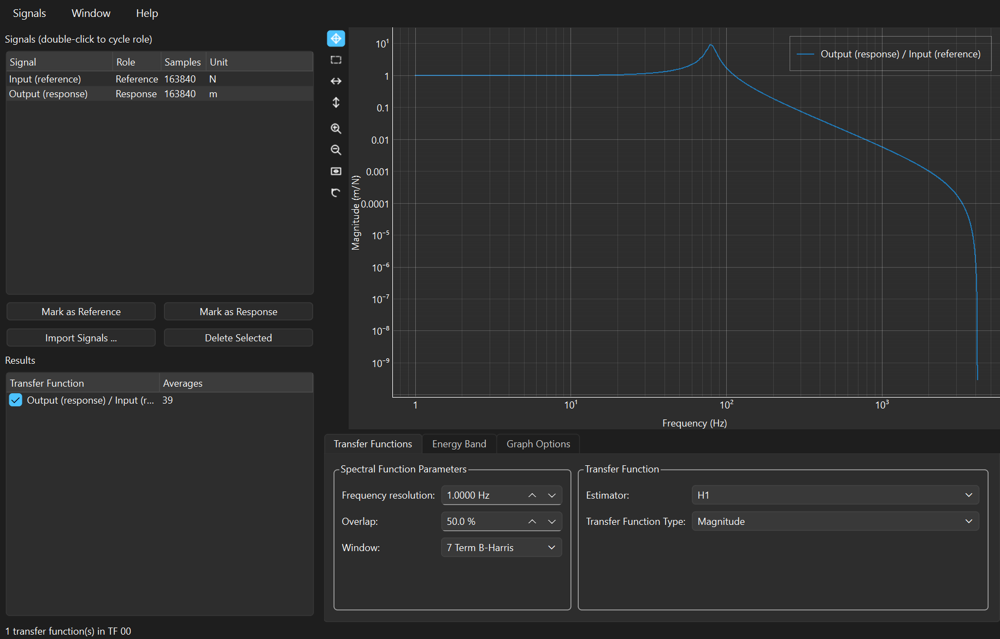
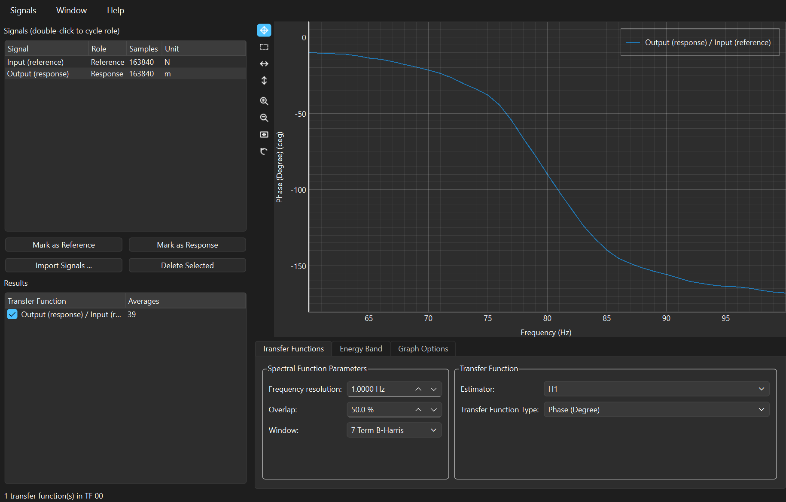
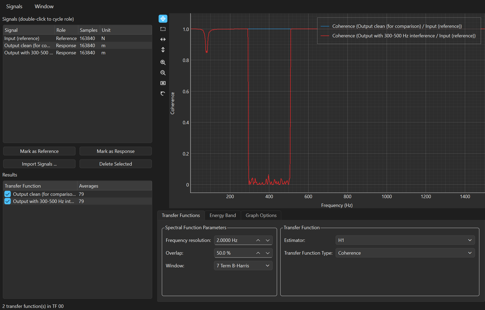
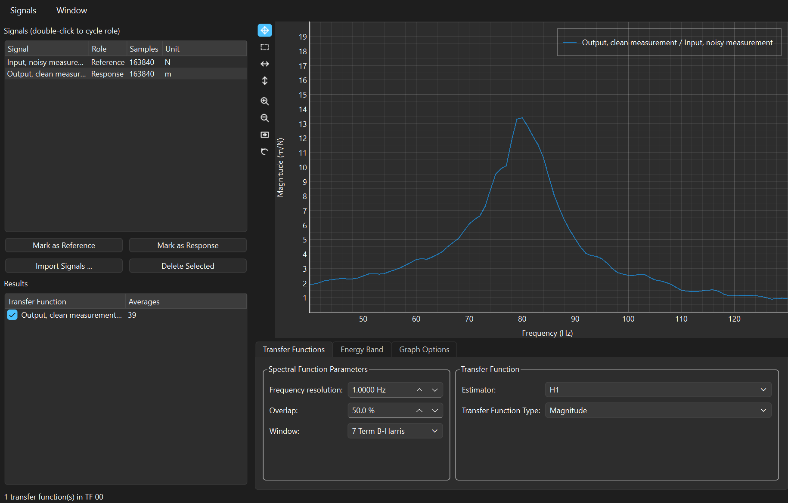
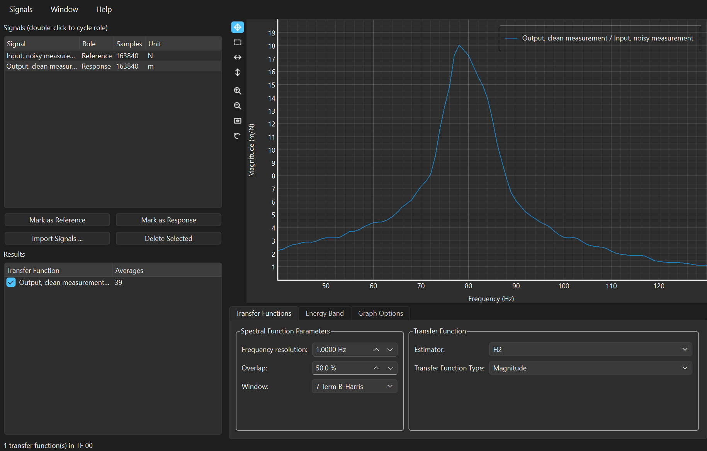

# Transfer Function

The Transfer Function window measures how a system responds: you feed in
one signal, record another coming out, and it tells you what the system did
between them, frequency by frequency. It also tells you something the
magnitude alone cannot — **how much of the output the input actually
caused** — which is the difference between a measurement and a picture.

Everything in this manual is worked on the demonstration files in `.data/`,
whose expected values are checked by `tools/verify_demo_data.py`. Every
number quoted below was produced by the application itself, not derived on
paper — so if a number here disagrees with your screen, that is a bug worth
reporting.

> **▶ Prefer to run it?** Every example here is also a section of the
> companion notebook,
> [**Transfer Function — worked examples**](notebooks/transfer-function.ipynb),
> which GitHub renders with all its output and graphs. It computes the same
> numbers in a few lines of `spwb.processing` — no GUI, no Qt — and asserts
> each one. Its source is
> [`examples/manuals/transfer_function.py`](../../examples/manuals/transfer_function.py).

**Contents**

* [Where this comes from](#where-this-comes-from)
* [Getting the demo files](#getting-the-demo-files)
* [Opening the window](#opening-the-window)
* [A tour of the controls](#a-tour-of-the-controls)
* [Worked example 1 — a resonance you already know the answer to](#worked-example-1--a-resonance-you-already-know-the-answer-to)
* [Worked example 2 — coherence, or how much of this did the input cause](#worked-example-2--coherence-or-how-much-of-this-did-the-input-cause)
* [Worked example 3 — H1, H2, and where the noise is](#worked-example-3--h1-h2-and-where-the-noise-is)
* [Getting the numbers out](#getting-the-numbers-out)
* [The maths, and how it is pinned to LabVIEW](#the-maths-and-how-it-is-pinned-to-labview)
* [Tips and traps](#tips-and-traps)
* [The same analysis in a notebook](#the-same-analysis-in-a-notebook)
* [Reference tables](#reference-tables)

---

## Where this comes from

**It starts with a telephone problem.** By the 1920s long-distance calls
were carried through chains of amplifiers, and every amplifier added its own
distortion, which accumulated down the line until speech became unusable. In
August 1927, on the ferry across the Hudson to work, Harold Black of Bell
Labs worked out the fix and sketched it on a page of his newspaper: throw
most of the gain away and feed the output back to the input, so the
amplifier corrects its own errors. Negative feedback made continental
telephony possible.

**And it immediately created a new problem.** Feed a signal back and the
system can sing — oscillate — and whether it does depends on what the
amplifier does to *amplitude and phase together*, at every frequency.
Harry Nyquist answered that in 1932 with his stability criterion, and
Hendrik Bode's 1945 *Network Analysis and Feedback Amplifier Design* gave
engineers the tool they still use: plot gain and phase against a logarithmic
frequency axis and you can see stability. That plot is what this window
draws. When you switch **Transfer Function Type** between Magnitude and
Phase, you are looking at the two halves of a Bode plot.

**Then measurement got harder, in a useful way.** Feeding a system one tone
at a time is slow, so from the 1960s people excited structures and circuits
with *random* noise instead and computed the response from the averaged
cross-spectra. That works — but it raises a question a swept tone never
did: if I shake a bridge with noise and measure a response, how do I know
the response came from my shaker and not from the traffic, the wind, or the
amplifier's own hiss?

**Coherence is the answer, and it is the reason this window has two
outputs rather than one.** The mathematics goes back to Norbert Wiener's
generalized harmonic analysis in 1930; the practical form engineers use was
set out by Julius Bendat and Allan Piersol, whose *Random Data* (1966 and
still in print) is the book behind almost every coherence plot ever drawn.
Coherence γ² runs from 0 to 1 and answers exactly one question, at each
frequency: **what fraction of the output power is linearly explained by the
input?** A coherence of 1 means all of it. A coherence of 0.5 means half
your measurement is something else. It costs nothing extra to compute — it
falls out of the same averaged spectra — and it is the single most useful
number in the window.

**Finally, the estimators.** Once you accept there is noise, you have to
say *where*. Experimental modal analysis in the 1970s and 80s — hitting
structures with instrumented hammers, measuring with accelerometers, the
discipline codified in Ewins's *Modal Testing* — settled on three answers.
**H1** assumes the noise is on the response, which is usually true when you
drive hard and measure a small motion. **H2** assumes it is on the
reference, which is what happens when the excitation itself is poorly
measured. **H3** splits the difference. SPWB's LabVIEW original computed
H1; the port offers all three, because they fall out of the same spectra
and answer different questions about the same measurement.

<details>
<summary>Sources, if you want to check any of this</summary>

* H. S. Black, "Stabilized feedback amplifiers", *Bell System Technical
  Journal*, 1934; the ferry sketch is 1927, the patent 1937.
* H. Nyquist, "Regeneration theory", *Bell System Technical Journal*, 1932.
* H. W. Bode, *Network Analysis and Feedback Amplifier Design*, 1945.
* N. Wiener, "Generalized harmonic analysis", *Acta Mathematica*, 1930.
* J. S. Bendat and A. G. Piersol, *Random Data: Analysis and Measurement
  Procedures*, first published 1966 — the standard reference for
  coherence and the H1/H2 estimators.
* D. J. Ewins, *Modal Testing: Theory and Practice*, 1984.

</details>

---

## Getting the demo files

The datasets are generated rather than shipped, from a fixed seed, so
everyone's copy is identical. Three ways, all producing the same files:

* in the application, **File > Create Demo Data ...**, which asks where to
  put them — no checkout needed, this works from `pip install spwb[gui]`;
* in a script or notebook,
  `from spwb.demo import write_demo_data; write_demo_data("demo-data")`;
* from a source checkout, `python tools/make_demo_data.py`.

---

## Opening the window

Load signals into a **Time Processing** window, tick the ones you want, then
**Analysis > Transfer Functions ...** (`Ctrl+T`). The window can also pull
signals in for itself with **Signals > Import Signals ... > Another Window**
(`Ctrl+I`), or the **Import Signals ...** button.

**Then assign roles**, which is the step with no equivalent in the FFT
window. Every signal is a **Reference** (an input), a **Response** (an
output), or `(unused)`. Select rows and press **Mark as Reference** /
**Mark as Response**, or **double-click a row to cycle** through the three.

When signals first arrive the window guesses: the first becomes the
Reference and everything after it a Response. That is right often enough to
be convenient and wrong often enough to be worth checking — the **Role**
column is there so a wrong guess is visible rather than silent.

Every reference is then paired with every response, so two references and
three responses give six transfer functions, listed under **Results** with
a checkbox each.

---

## A tour of the controls

This is the window on `09_TF_SDOF_resonance_H1.h5`, with both axes
logarithmic — the Bode magnitude plot of a resonance:



### The signal list and Results list

| Column | Meaning |
|---|---|
| **Signal** / **Role** | The signal and whether it is a Reference, a Response, or unused |
| **Samples**, **Unit** | As loaded |

**Results** lists one row per reference × response pair, named
`response / reference`, with the number of **Averages** used. The checkbox
shows and hides each curve.

### Transfer Functions tab

| Control | Default | What it does |
|---|---|---|
| **Frequency resolution** | 1.0000 Hz | Block length, `L = fs / df`. On a lightly damped resonance this is the control that matters most — see [example 1](#worked-example-1--a-resonance-you-already-know-the-answer-to). |
| **Overlap** | **50.0 %** | Overlapping blocks recover averages lost to fine resolution. Note the FFT window defaults to 0 %; this one starts at 50 % because transfer functions need averaging to converge at all. |
| **Window** | **7 Term B-Harris** | Also different from the FFT window's Hanning. A transfer function divides one spectrum by another, and leakage in either corrupts both — so the default is a window with very low sidelobes. |
| **Estimator** | H1 | H1, H2 or H3 — [example 3](#worked-example-3--h1-h2-and-where-the-noise-is). |
| **Transfer Function Type** | Magnitude | Magnitude, four flavours of phase, or Coherence. |

Changing the display type is instant and lossless: the complex response is
computed once and stored, and the display only presents it differently.

### Energy Band tab

**Start** and **End Frequency**, and a table of **Mean |H|** and **Mean
Coherence** over that band for every result. The mean coherence is the
quickest way to ask "is my measurement any good in the band I care about?"

### Graph Options tab

**Frequency axis** and **Amplitude axis**, each Linear or Logarithmic. A
Bode plot is log-log; the Coherence display ignores the log-amplitude
setting, since coherence is a fraction between 0 and 1.

### Menus

| Menu | Contents |
|---|---|
| **Signals** | Import Signals ... > Another Window (`Ctrl+I`), Export results to clipboard, Exit |
| **Window** | New TF Window (`Ctrl+N`) |
| **Help** | **Transfer Function Manual** (`F1`) — this page, All User Manuals ..., About SPWB |

---

## Worked example 1 — a resonance you already know the answer to

**File:** `09_TF_SDOF_resonance_H1.h5` — white noise through a
single-degree-of-freedom resonance at **80 Hz** with **5 % damping**
(Q = 10), recorded for 20 s at 8192 Hz.

Load it, confirm *Input (reference)* is the Reference and *Output
(response)* the Response, and leave every setting alone. You get the plot
above: flat at low frequency, a sharp peak, then a roll-off. With the
defaults it reports **39 averages**.

Three numbers are worth reading off it.

**The DC gain is 1.00006.** At frequencies far below resonance the system
passes the input straight through, which is what a mass-spring-damper does.
The unit reads `m/N` — output unit over input unit, taken from the signals
themselves.

**The magnitude peaks at 79 Hz, not 80.** That is not an error, and it is
not only the bin spacing: a damped resonance peaks slightly *below* the
natural frequency, at fn·√(1−2ζ²) = **79.80 Hz**. The peak value is
**9.24**, against a theoretical Q of 10.

**The phase crosses −90° at exactly 80 Hz** — measured **−89.897°**:



This is why phase is the reliable way to read a natural frequency. The
magnitude peak moves with damping and with your frequency resolution; the
−90° crossing sits at fn regardless. Switch **Transfer Function Type** to
`Phase (Degree)` and read across.

### The coherence dip, and why it is the most useful trap in the window

Switch to `Coherence` and the curve is 1.000 everywhere — except for a few
bins right at the resonance, where it dips to **0.947**.

Nothing is contaminating this measurement. The output was computed from the
input and nothing else. The dip is **bias error**: inside a single 1 Hz bin
the response changes steeply, so the estimator is averaging a value that is
not constant across the bin, and coherence reports that as lost linearity.

Coarsen the resolution and watch it get worse — and take the peak with it:

| Frequency resolution | Averages | Peak \|H\| | Peak at | Coherence at the peak |
|---|---|---|---|---|
| 0.125 Hz | 4 | **10.126** | 79.875 Hz | 0.9994 |
| 0.25 Hz | 9 | 10.039 | 80.500 Hz | 0.9967 |
| 0.5 Hz | 19 | 9.965 | 80.000 Hz | 0.9882 |
| **1 Hz** (default) | 39 | 9.241 | 79.000 Hz | 0.9474 |
| 2 Hz | 79 | 7.861 | 80.000 Hz | 0.8180 |
| 4 Hz | 159 | 6.013 | 80.000 Hz | 0.6053 |
| 8 Hz | 319 | 4.168 | 80.000 Hz | 0.3942 |

Read the top row: at 0.125 Hz the measurement recovers **Q = 10.13** against
a true 10, and a peak at **79.875 Hz** against a true 79.80. Read the
bottom: at 8 Hz the same data reports a Q of 4.2 — a resonance
**less than half** as sharp as the real one, which in damping terms is a
factor-of-two error in the direction that makes a structure look safer than
it is.

**This is the classic trap when testing lightly damped structures**, and the
reason it matters is that nothing looks wrong. The magnitude curve at 8 Hz
resolution is smooth and plausible. Only the coherence tells you, and only
if you look.

**The rule:** a coherence dip *at a resonance*, with high coherence either
side, means insufficient resolution — refine `df`. A coherence dip
*elsewhere* means something else is driving your output, which is
[example 2](#worked-example-2--coherence-or-how-much-of-this-did-the-input-cause).

**One more reason to leave the window alone.** The default 7 Term
Blackman-Harris is not decoration. Repeat this measurement with a
Rectangle window and the median coherence across the band collapses from
**0.99998 to 0.542** — leakage in the two spectra being divided destroys the
linearity the estimator is trying to measure.

---

## Worked example 2 — coherence, or how much of this did the input cause

**File:** `10_TF_Coherence_partial.h5` — the same 80 Hz resonance, but the
response now carries interference between 300 and 500 Hz that the input did
not cause. A clean copy of the output is included so you can compare.

Load it, mark *Input (reference)* as the Reference and both outputs as
Responses, set **Frequency resolution** to 2 Hz, and switch **Transfer
Function Type** to `Coherence`:



| Band | Contaminated output | Clean output |
|---|---|---|
| 320–480 Hz | **0.013** (minimum 0.0001) | 0.99987 |
| 600–1500 Hz | 0.99998 | 0.99998 |
| 60–100 Hz | 0.935 | 0.935 |

The collapse is total and confined exactly to the interference band. Away
from it, both outputs are indistinguishable at 0.99998. And the dip around
80 Hz is **the same 0.935 in both** — that is the bias error from example 1,
present whether or not there is interference, which is how you tell the two
apart.

**Now the point of all this.** Switch back to `Magnitude` and read the
response at 400 Hz:

| | \|H\| at 400 Hz |
|---|---|
| Contaminated output | **1.370** |
| Clean output | **0.0706** |

The contaminated measurement over-reads by a factor of **19**. Plotted on
its own it looks like a real feature of the system — a broad hump between
300 and 500 Hz that you might spend a day chasing. There is nothing in the
magnitude curve to say it is fictitious. The coherence says so immediately,
and that is the entire argument for looking at it every time.

**What to do about a genuine coherence drop:** average more (more blocks,
or turn up **Overlap**), drive the input harder so the real response
dominates the interference, or accept that the band is unmeasurable with
this setup and say so. What you must not do is quote the magnitude.

---

## Worked example 3 — H1, H2, and where the noise is

**File:** `11_TF_H1_vs_H2_input_noise.h5` — the same resonance, but this
time the noise is on the **input**: the excitation is measured badly and the
response cleanly. This is the case H1 gets wrong.

Load it and look at the peak under each estimator:




| Estimator | Peak \|H\| | Peak at | \|H(0)\| | \|H\| at 200 Hz |
|---|---|---|---|---|
| **H1** | 13.392 | 80 Hz | 1.285 | 0.295 |
| **H3** | 15.323 | 79 Hz | 1.655 | 0.323 |
| **H2** | **18.045** | 78 Hz | 2.132 | 0.354 |

H1 under-reads by about 25 %, uniformly. The mean coherence across
20–1000 Hz is **0.796** — and that number is not a coincidence:

```
mean(H1 / H2)  = 0.79575
mean(coherence) = 0.79575
```

**H1 = γ² · H2 exactly**, everywhere, always. It is an algebraic identity,
not a property of this dataset: H1 = Sxy/Sxx and H2 = Syy/Syx, so their
ratio is |Sxy|²/(Sxx·Syy), which *is* the coherence. So whenever coherence
is below 1, H1 reads low by exactly that factor and H2 reads high by it.
Which of them is right depends entirely on where the noise is:

* **noise on the response** → the noise inflates Syy but not Sxy, so H2 is
  biased high and **H1 is correct**. This is the usual case in modal
  testing, and it is why H1 is the default;
* **noise on the reference** → the noise inflates Sxx but not Sxy, so H1 is
  biased low and **H2 is correct**. This file;
* **noise on both** → neither is right; H3 sits between them.

**The clean case, for contrast.** Go back to file 09, where the measurement
is uncontaminated, and the estimators agree to six digits everywhere the
coherence is 1:

| Frequency | H1 | H2 | Ratio |
|---|---|---|---|
| 10 Hz | 1.015528 | 1.015537 | 0.999991 |
| 200 Hz | 0.189379 | 0.189422 | 0.999774 |
| 1000 Hz | 0.005815 | 0.005815 | 0.999994 |
| **79 Hz** (the peak) | 9.241412 | 9.754377 | **0.947412** |

They diverge in exactly one place — the resonance — by exactly the
coherence there. Even "clean" data has a place where the estimator choice
changes the answer, and coherence tells you where to look.

**How to know which to use on real data.** Ask which channel you trust. A
shaker test with a good force cell and a tiny accelerometer signal: noise is
on the response, use H1. A rig where the excitation is inferred rather than
measured: noise is on the reference, use H2. If you cannot say, compute both
— the gap between them *is* the uncertainty, and it equals the coherence.

---

## Getting the numbers out

* **Signals > Export results to clipboard** copies every visible result in
  the current display type — one frequency column, then one per curve.
  Switch to Coherence and export again to get both.
* **Export table to clipboard** on the Energy Band tab copies the band
  summary. On file 09 with the default settings:

| Band | Mean \|H\| | Mean coherence |
|---|---|---|
| 0–1000 Hz | 0.340 | 0.9992 |
| 60–100 Hz | 4.484 | 0.9820 |
| 300–500 Hz | 0.0441 | 1.0000 |

---

## The maths, and how it is pinned to LabVIEW

The chain, from `TFSA - TF and Coherence V2.vi`:

1. **Block and window both signals** identically — same length, same
   overlap, same window — then transform each block.
2. **Accumulate three averaged spectra**: `Sxx` (reference auto-power),
   `Syy` (response auto-power) and `Sxy` (cross-power, complex).
3. **Only then combine them**:
   `H1 = Sxy/Sxx`, `H2 = Syy/Syx`, `H3 = √(H1·H2)`, and
   `γ² = |Sxy|² / (Sxx·Syy)`.
4. **Duplicate the last bin** so the result spans 0 Hz to fs/2 inclusive,
   as SPWB does.

Step 3 coming after step 2 is not a detail. The original block diagram
carries two warnings from its author, and the port honours both:

> "MUST perform the averages first, before computing the transfer function"
> "The average has to be done on the complex numbers"

Averaging per-block `H` values instead — or averaging magnitudes and
discarding phase — destroys the noise rejection that makes H1 worth having,
and makes coherence come out as exactly 1 everywhere, which looks like a
perfect measurement and is worthless. If your coherence is 1.000 at every
frequency including places it has no business being, that is the bug to
suspect.

The complex response is kept in the result's `TF_Complex` attribute, so
Magnitude, the four phase displays and Coherence are all views of one
computation.

**None of these numbers were re-derived.** The test suite compares them
against reference data generated by driving LabVIEW 2022 itself over COM,
committed in `tests/fixtures/`.

---

## Tips and traps

**Check the Role column before believing anything.** The window's guess —
first signal is the reference — is a convenience, not a deduction. A
transfer function computed with the roles swapped is the reciprocal of the
one you wanted, and it looks entirely plausible.

**Look at coherence first, magnitude second.** Every time. It costs one
click and it is the only thing in the window that can tell you the
measurement is worthless.

**A dip at a resonance is your resolution; a dip elsewhere is your rig.**
The first is fixed with a finer `df`, the second is not fixable by
processing at all.

**Finer resolution costs averages, and you need both.** Halving `df` halves
the number of blocks. Overlap is how you buy some back — this window starts
at 50 % for that reason.

**Do not use a Rectangle window here.** It drops the median coherence on a
clean measurement from 0.99998 to 0.542.

**H1 and H2 differ by exactly the coherence.** If they differ noticeably,
your coherence is not 1, and you should find out why before choosing between
them.

**The window is named in its title bar** — `TF 00` — and that is what
appears in other windows' Import dialogs.

---

## The same analysis in a notebook

Everything above is the GUI driving a library that has no idea Qt exists.
All three examples are worked in code in the companion notebook —
[**Transfer Function — worked examples**](notebooks/transfer-function.ipynb),
source at
[`examples/manuals/transfer_function.py`](../../examples/manuals/transfer_function.py).
Run it with:

```bash
python examples/manuals/transfer_function.py
```

In miniature:

```python
import numpy as np
from spwb.processing.dsp import transfer_function
from spwb.processing.io import read_hdf5

signals = {s.name: s for s in read_hdf5(
    "demo-data/09_TF_SDOF_resonance_H1.h5")}

tf, coherence = transfer_function(
    signals["Input (reference)"], signals["Output (response)"],
    freq_resolution=1.0, overlap=0.5, window="bh_7term", estimator="H1")

H = tf.attributes["TF_Complex"]          # the complex response
print(tf.name, tf.y_unit)                # 'Output (response) / Input (reference)' 'm/N'
print(float(np.abs(H).max()))            # 9.241412... the peak
print(np.degrees(np.angle(H[80])))       # -89.897... phase at 80 Hz
print(float(coherence.y[80]))            # 0.943790... the bias dip
```

`tf.y` already holds the magnitude, so it plots sensibly untouched; use
`format_transfer_function(tf, "Phase (Degree)", coherence)` to switch
display type as the combo box does.

---

## Reference tables

### Transfer Function Types

| Type | Shows | Unit |
|---|---|---|
| Magnitude | \|H\| | output/input, e.g. `m/N` |
| Phase (Rad) | Wrapped phase | `rad` |
| Phase Unwrap (Rad) | Continuous phase | `rad` |
| Phase (Degree) | Wrapped phase | `deg` |
| Phase Unwrap (Degree) | Continuous phase | `deg` |
| Coherence | γ², 0 to 1 | — |

### Estimators

| Estimator | Formula | Assumes noise on | Bias |
|---|---|---|---|
| **H1** | Sxy / Sxx | The **response** | Under-reads by γ² if noise is on the reference |
| **H2** | Syy / Syx | The **reference** | Over-reads by 1/γ² if noise is on the response |
| **H3** | √(H1·H2) | Both | Between the two |

H1 = γ²·H2 identically, so the three coincide wherever coherence is 1.

### Reading a coherence value

| γ² | Meaning |
|---|---|
| 1.000 | Everything in the output is explained by the input |
| 0.95–0.999 at a resonance only | Bias error — refine the frequency resolution |
| < 0.9 in a band | Something else is driving the output, or noise dominates |
| ≈ 0 | The magnitude in that band is meaningless |
| Exactly 1.000 everywhere | Suspicious — see the port notes above |

### Demo files used in this manual

| File | Shows |
|---|---|
| `09_TF_SDOF_resonance_H1.h5` | A known resonance; the −90° phase crossing; bias error vs resolution |
| `10_TF_Coherence_partial.h5` | Coherence collapsing where the input did not cause the output |
| `11_TF_H1_vs_H2_input_noise.h5` | Noise on the input; H1 vs H2 and the γ² identity |

Confirm every value in this manual with `python tools/verify_demo_data.py`.

---

## Support This Work

If anything here was useful to you, please consider contributing.
SPWB is free and open source, and always will be — donations are
what let Charette AI Group keep maintaining it and open-sourcing
its other tools.

<p align="center">
  <a href="https://www.paypal.com/donate/?hosted_button_id=FEM4WLD7LHY36">
      
  </a>
</p>
